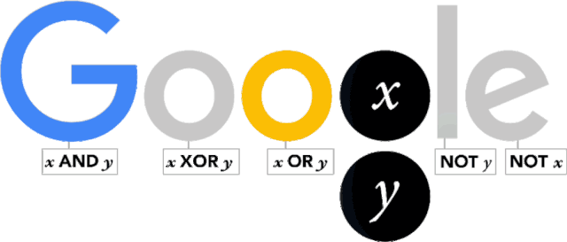
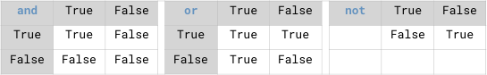
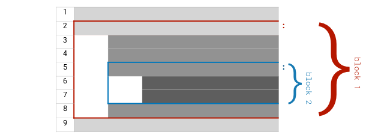

# 入口

“速成”，對絕大多數人<a href='#fn1' name='fn1b'><sup>[1]</sup></a>來說，在絕大多數情況下，是不大可能的。

編程如此，自學編程更是如此。有時，遇到複雜度高一點的知識，連快速入門都不一定是很容易的事情。

所以，這一章的名稱，特意從 “_入門_” 改成了 “**入口**” —— 它的作用是給你 “指一個入口”，至於你能否從那個入口進去，是你自己的事了……

不過，有一點不一樣的地方，我給你指出的入口，跟別的編程入門書籍不一樣 —— 它們幾乎無一例外都是從一個 “Hello World!” 程序開始的…… 而我們呢？

讓我們從認識一個人開始罷……

## 喬治·布爾

1833 年，一個 18 歲的英國小伙腦子裡閃過一個念頭：

> **邏輯關係**應該能用**符號**表示。

這個小伙子叫喬治·布爾（[George Boole](https://en.wikipedia.org/wiki/George_Boole)，其實之前就提到過我的這位偶像），於 1815 年出生於距離倫敦北部 120 英里之外的一個小鎮，林肯。父親是位對科學和數學有著濃厚興趣的鞋匠。喬治·布爾在父親的影響下，靠閱讀自學成才。14 歲的時候就在林肯小鎮名聲大噪，因為他翻譯了一首希腊語的詩歌併發表在本地的報紙上。

到了 16 歲的時候，他被本地一所學校聘為教師，那時候他已經在閱讀微積分書籍。19 歲的時候布爾創業了 —— 他辦了一所小學，自任校長兼教師。23 歲，他開始發表數學方面的論文。他發明瞭 “操作演算”，即，通過操作符號來研究微積分。他曾經考慮過去劍橋讀大學，但後來放棄了，因為為了入學他必須放下自己的研究，還得去參加標準本科生課程。這對一個長期只靠自學成長的人來說，實在是太無法忍受了。

1847 年，喬治 32 歲，出版了他人生的第一本書籍，[THE MATHEMATICAL ANALYSIS OF LOGIC](http://www.gutenberg.org/ebooks/36884) —— 18 歲那年的閃念終於成型。這本書很短，只有 86 頁，但最終它竟然成了人類的瑰寶。在書里，喬治·布爾很好地解釋瞭如何使用代數形式表達邏輯思想。

1849 年，喬治·布爾 34 歲，被當年剛剛成立的女皇學院（Queen's College）聘請為第一位數學教授。隨後他開始寫那本最著名的書，[AN INVESTIGATION OF THE LAWS OF THOUGHT](http://www.gutenberg.org/ebooks/15114)。他在前言里寫到：

>  “The design of the following treatise is to investigate the fundamental laws of those operations of the mind by which reasoning is performed; to give expression to them in the symbolical language of a Calculus, and upon this foundation to establish the science of Logic and construct its method; …”
>
> “本書論述的是，探索心智推理的基本規律；用微積分的符號語言進行表達，併在此基礎上建立邏輯和構建方法的科學……”

在大學任職期間，喬治·布爾寫了兩本教科書，一本講微分方程，另外一本講差分方程，而前者，[A TREATISE ON DIFFERENTIAL EQUATIONS](https://archive.org/details/atreatiseondiff06boolgoog/page/n7)，直到今天，依然難以超越。


喬治·布爾於 1864 年因肺炎去世。

喬治·布爾在世的時候，人們並未對他的布爾代數產生什麼興趣。直到 70 年後，克勞德·香農（[Claude Elwood Shannon](https://en.wikipedia.org/wiki/Claude_Shannon)）發表那篇著名論文，[A SYMBOLIC ANALYSIS OF RELAY AND SWITCHING CIRCUITS](https://www.cs.virginia.edu/~evans/greatworks/shannon38.pdf) 之後，布爾代數才算是開始被大規模應用到實處。

有本書可以閑暇時間翻翻，[The Logician and the Engineer: How George Boole and Claude Shannon Created the Information Age](https://www.amazon.com/gp/product/B0091XBUTM/ref=dbs_a_def_rwt_hsch_vapi_tkin_p1_i4)。可以說，沒有喬治·布爾的**布爾代數**，沒有克勞德·香農的**邏輯電路**，就沒有後來的計算機，就沒有後來的互聯網，就沒有今天的信息時代 —— 世界將會怎樣？

2015 年，喬治·布爾誕辰 200 周年，Google 設計了[專門的 Logo](https://www.google.com/doodles/george-booles-200th-birthday) 紀念這位為人類作出巨大貢獻的自學奇才。



Google Doodle 的寄語是這樣的：

> A very happy **11001000**_th_ birthday to genius George Boole!

## 布爾運算

從定義上來看，所謂**程序**（Programs）其實一點都不神秘。

因為程序這個東西，不過是按照一定_順序_完成任務的**流程**（Procedures）。根據定義，日常生活中你做盤蛋炒飯給自己吃，也是完成了一個 “做蛋炒飯” 的程序 —— 你按部就班完成了一系列的步驟，最終做好了一碗蛋炒飯給自己吃 —— 從這個角度望過去，所有的菜譜都是程序…… 

只不過，菜譜這種程序，編寫者是人，執行者還是人；而我們即將要學會寫的程序，編寫者是人，執行者是計算機 —— 當然，菜譜用自然語言編寫，計算機程序由程序員用編程語言編寫。

然而，這些都不是最重要的差異 —— 最重要的差異在於計算機能做**布爾運算**（Boolean Operations）。

於是，一旦代碼編寫好之後，計算機在執行的過程中，除了可以 “_按照順序執行任務_” 之外，還可以 “_根據不同情況執行不同的任務_”，比如，“_如果條件尚未滿足則重覆執行某一任務_”。

計算器和計算機都是電子設備，但計算機更為強大的原因，用通俗的說法就是它 “**可編程**”（Programable） —— 而所謂可編程的核心就是_布爾運算_及其相應的**流程控制**（Control Flow）；沒有布爾運算能力就沒有辦法做_流程控制_；沒有流程控制就只能 “按順序執行”，那就顯得 “很不智能”…… 

### 布爾值

在 Python 語言中，**布爾值**（Boolean Value）用 `True` 和 `False` 來表示。

**註意**：請小心區分大小寫 —— 因為 Python 解釋器是大小寫敏感的，對它來說，`True` 和 `true` 不是一回事。

任何一個**邏輯表達式**都會返回一個_布爾值_。
```python
from IPython.core.interactiveshell import InteractiveShell
InteractiveShell.ast_node_interactivity = "all"
# 請暫時忽略以上兩行……

1 == 2
1 != 2
```
    True


`1 == 2`，用自然語言描述就是 “_1 等於 2 嗎？_” —— 它的布爾值當然是 `False`。

`1 != 2`，用自然語言描述就是 “_1 不等於 2 嗎？_” —— 它的布爾值當然是 `True`。

**註意**：自然語言中的 “_等於_”，在 Python 編程語言中，使用的符號是 `==`，**不是一個等號！**

**請再次註意**：單個等號 `=`，有其他的用處。初學者最不適應的就是，在編程語言里所使用的操作符，與他們之前在其他地方已經習慣了的使用方法並不相同 —— 不過，適應一段時間就好了。

### 邏輯操作符

Python 語言中的**邏輯操作符**（Logical Operators）如下表所示 —— 為了理解方便，也可以將其稱為 “_比較操作符_”。

| 比較操作符 | 意義     | 示例             | 布爾值  |
| ---------- | -------- | ---------------- | ------- |
| `==`       | 等於     | `1 == 2`         | `False` |
| `!=`       | 不等於   | `1 != 2`         | `True`  |
| `>`        | 大於     | `1 > 2`          | `False` |
| `>=`       | 大於等於 | `1 >= 1`         | `True`  |
| `<`        | 小於     | `1 < 2`          | `True`  |
| `<=`       | 小於等於 | `1 <= 2`         | `True`  |
| `in`       | 屬於     | `'a' in 'basic'` | `True`  |

除了等於、大於、小於之外，Python 還有一個邏輯操作符，`in`：

這個表達式 `'a' in 'basic'` 用自然語言描述就是：

> “`'a'` 存在於 `'basic'` 這個字符串之中嗎？”（屬於關係）

### 布爾運算操作符

以上的例子中，邏輯操作符的**運算對象**（Operands）是數字值和字符串值。

而針對布爾值進行運算的操作符很簡單，只有三種：與、或、非：

> 分別用 `and`、`or`、`not` 表示

**註意**：它們全部是小寫。因為布爾值只有兩個，所以布爾運算結果只有幾種而已，如下圖所示：



先別管以下代碼中 `print()` 這個函數的工作原理，現在只需要關註其中布爾運算的結果：
```python
print('(True and False) yields:',  True and False)
print('(True and True) yields:',  True and True)
print('(False and True) yields:',  False and True)
print('(True or False) yields:',  True or False)
print('(False or True) yields:',  False or True)
print('(False or False) yields:',  False or False)
print('(not True) yields:',  not True)
print('(not False) yields:',  not False)
```
    (True and False) yields: False
    (True and True) yields: True
    (False and True) yields: False
    (True or False) yields: True
    (False or True) yields: True
    (False or False) yields: False
    (not True) yields: False
    (not False) yields: True


千萬不要誤以為布爾運算是_理科生_才必須會、才能用得上的東西…… 文理藝分科是中國的特殊分類方式，真挺害人的。比如，設計師們在計算機上創作圖像的時候，也要頻繁使用_或與非_的布爾運算操作才能完成各種圖案的拼接…… 抽空看看這個網頁： [Boolean Operations used by Sketch App](https://sketchapp.com/docs/shapes/boolean-operations/) —— 這類設計軟件，到最後是每個人都用得上的東西呢。另，難道藝術生不需要學習文科或者理科？—— 事實上，他們也有文化課……


## 流程控制

有了布爾運算能力之後，才有_根據情況決定流程_的所謂**流程控制**（Flow Control）的能力。
```python
import random
r = random.randrange(1, 1000)
# 請暫時忽略以上兩句的原理，只需要瞭解其結果：
# 引入隨機數，而後，每次執行的時候，r 的值不同

if r % 2 == 0:
    print(r, 'is even.')
else:
    print(r, 'is odd.')
```
    693 is odd.


你可以多執行幾次以上程序，看看每次不同的執行結果。執行方法是，選中上面的 Cell 之後按快捷鍵 `shift + enter`。

現在看代碼，先忽略其它的部分，只看關鍵部分：
```python
    ...
    if r % 2 == 0:
        ...
    else:
        ...
```
這個 `if/else` 語句，完成了流程的**分支**功能。 `%` 是計算餘數的符號，如果 `r` 除以 `2` 的餘數等於 `0`，那麼它就是偶數，否則，它就是奇數 —— 寫成布爾表達式，就是 `r % 2 == 0`。

這一次，你看到了單個等號 `=`：`r = random.randrange(1, 1000)`。

這個符號在絕大多數編程語言中都是 “**賦值**”（Assignment）的含義。

在 `r = 2` 之中，`r` 是一個名稱為 `r` 的**變量**（Variable）—— 現在只需要將變量理解為程序_保存數值的地方_；而 `=` 是賦值符號，`2` 是一個整數**常量**（Literal）。

語句 `r = 2` 用自然語言描述就是：

> “把 `2` 這個值保存到名稱為 `r` 的變量之中”。

現在先別在意頭兩行代碼的工作原理，只關註它的工作結果：`random.randrange(1, 1000)` 這部分代碼的作用是返回一個 _1 到 1000 之間_（含左側 `1` 但不含右側 `1000`）的隨機整數。每次執行以上的程序，它就生成一個新的隨機整數，然後因為 `=` 的存在，這個數就被保存到 `r` 這個變量之中。

計算機程序的所謂 “智能”（起碼相對於計算器），首先是因為它能做_布爾運算_。計算機的另外一個好處是 “不知疲倦”（反正它也不用自己交電費），所以，它最擅長處理的就是 “重覆”，這個詞在程序語言中，術語是**循環**（Loop）。以下程序會打印出 `10` 以內的所有奇數：
```python
for i in range(10):
    if i % 2 != 0:
        print(i)
```
    1
    3
    5
    7
    9


其中 `range(10)` 的返回值，是 `0～9` 的整數序列（默認起始值是 `0`；含左側 `0`，不含右側 `10`）。

用自然語言描述以上的程序，大概是這樣的 —— 自然語言寫在 `#` 之後：
```python
for i in range(10): # 對於 0～9 中的所有數字都帶入 i 這個變量，執行一遍以下任務：
    if i % 2 != 0:  #     如果 i 除以 2 的餘數不等於零的話，執行下麵的語句：
        print(i)    #         向屏幕輸出 i 這個變量中所保存的值
```
就算你讓它打印出一百億以內的奇數，它也毫不含糊 —— 你只需要在 `range()` 這個函數的括號里寫上一個那麼大的整數就行……

讓它乾一點稍微複雜的事吧，比如，我們想要打印出 `100` 以內所有的_質數_（Primes）。

根據質數的定義，它大於等於 `2`，且只有在被它自身或者 `1` 做為除數時餘數為 `0`。判斷一個數字是否是質數的**算法**是這樣的：

> * 設 `n` 為整數，`n >= 2`；
> * 若 `n == 2`，`n` 是質數；
> * 若 `n > 2`，就把 `n` 作為被除數，從 `2` 開始一直到 `n - 1` 都作為除數，_逐一_計算看看餘數是否等於 `0`？
>> * 如果是，那就不用接著算了，它不是質數；
>> * 如果全部都試過了，餘數都不是 `0`，那麼它是質數。

於是，你需要兩個**嵌套**的循環，第一個負責作為被除數 `n` 從 `2` 到 `99`（題目是 `100` 以內，所以不包含 `100`）的循環；而這內部，需要另外一個作為除數負責 `i` 從 `2` 到 `n` 的循環：
```python
for n in range(2, 100): #range(2,100)表示含左側 2，不含右側 100，是不是第三次看到這個說法了？
    if n == 2:
        print(n)
        continue
    for i in range(2, n):
        if (n % i) == 0:
            break
    else:                  # 這裡目前你可能看不懂…… 但先關註結果吧。
        print(n)         
```
    2
    3
    5
    7
    11
    13
    17
    19
    23
    29
    31
    37
    41
    43
    47
    53
    59
    61
    67
    71
    73
    79
    83
    89
    97


## 所謂算法

以上的**算法**可以改進（程序員們經常用的詞彙是 “_優化_”）<a id='plusone'></a>：

> 從 `2` 作為除數開始試，試到 $\sqrt{n}$ 之後的一個整數就可以了……
```python
for n in range(2, 100):
    if n == 2:
        print(n)
        continue
    for i in range(2, int(n ** 0.5)+1): #為什麼要 +1 以後再說…… n 的 1/2 次方，相當於根號 n。
        if (n % i) == 0:
            break
    else:
        print(n)         
```
    2
    3
    5
    7
    11
    13
    17
    19
    23
    29
    31
    37
    41
    43
    47
    53
    59
    61
    67
    71
    73
    79
    83
    89
    97


你看，尋找更有效的算法，或者說，不斷優化程序，提高效率，最終是程序員的工作，不是編程語言本身的工作。關於判斷質數最快的算法，[可以看 Stackoverflow 上的討論](https://stackoverflow.com/questions/1801391/what-is-the-best-algorithm-for-checking-if-a-number-is-prime)，有更多時間也可以翻翻 [Wikipedia](https://en.wikipedia.org/wiki/Generating_primes)。

到最後，**所有的工具都一樣，效用取決於使用它的人**。所以，學會使用工具固然重要，更為重要的是與此同時自己的能力必須不斷提高。

雖然寫代碼這事剛開始學起來好像門檻很高，那隻不過是幻覺，其實門檻比它更高的多的去了。到最後，它就是個最基礎的工具，還是得靠思考能力 —— 這就好像識字其實挺難的 —— 小學初中高中加起來十來年，我們才掌握了基本的閱讀能力；可最終，即便是本科畢業、研究生畢業，真的能寫出一手好文章的人還是少之又少一樣 —— 因為用文字值得寫出來的是思想，用代碼值得寫出來的是創造，或者起碼是有意義的問題的有效解決方案。有思想，能解決問題，是另外一門手藝 —— 需要終生精進的手藝。

## 所謂函數

我們已經反覆見過 `print()` 這個**函數**（Functions）了。它的作用很簡單，就是把傳遞給它的值輸出到屏幕上 —— 當然，事實上它的使用細節也很多，以後慢慢講。

現在，最重要的是初步理解一個函數的基本構成。關於**函數**，相關的概念有：_函數名_（Function Name）、_參數_（Parameters）、_返回值_（Return Value）、_調用_（Call）。

拿一個更為簡單的函數作為例子，`abs()`。它的作用很簡單：接收一個數字作為參數，經過運算，返回該數字的絕對值。
```python
a = abs(-3.1415926)
a
```
    3.1415926


在以上的代碼的第 1 行中，

> * 我們_調用_了一個_函數名_為 `abs` 的函數；寫法是 `abs(-3.1415926)`；
> * 這麼寫，就相當於向它_傳遞_了一個_參數_，其值為： `-3.1415926`；
> * 該函數接收到這個參數之後，根據這個參數的_值_在函數內部進行了*運算*；
> * 而後該函數返回了一個值，_返回值_為之前接收到的參數的值的絕對值 `3.1415926`；
> * 而後這個_值_被保存到*變量* `a` 之中。

從結構上來看，每個函數都是一個完整的程序，因為一個程序，核心構成部分就是_輸入_、_處理_、_輸出_：

> * 它有輸入 —— 即，它能接收外部通過參數傳遞的值；
> * 它有處理 —— 即，內部有能夠完成某一特定任務的代碼；尤其是，它可以根據 “輸入” 得到 “輸出”；
> * 它有輸出 —— 即，它能向外部輸送返回值……

被調用的函數，也可以被理解為**子程序**（Sub-Program） —— 主程序執行到函數調用時，就開始執行實現函數的那些代碼，而後再返回主程序…… 

我們可以把判斷一個數字是否是質數的過程，寫成函數，以便將來在多處用得著的時候，隨時可以調用它：
```python
def is_prime(n):            # 定義 is_prime()，接收一個參數
    if n < 2:              # 開始使用接收到的那個參數（值）開始計算……
        return False       # 不再是返回給人，而是返回給調用它的代碼……
    if n == 2:
        return True
    for m in range(2, int(n**0.5)+1):
        if (n % m) == 0:
            return False
    else:
        return True

for i in range(80, 110):
    if is_prime(i):          # 調用 is_prime() 函數，
        print(i)            # 如果返回值為 True，則向屏幕輸出 i
```
    83
    89
    97
    101
    103
    107
    109


## 細節補充

### 語句

一個完整的程序，由一個或者多個**語句**（Statements）構成。通常情況下，建議每一行只寫一條語句。
```python
for i in range(10):
    if i % 2 != 0:
        print(i)
```
    1
    3
    5
    7
    9


### 語句塊

在 Python 語言中，**行首空白**（Leading whitespace，由空格 `' '` 或者 Tab `⇥` 構成）有著特殊的含義。

如果有行首空白存在，那麼，Python 將認為這一行與其他鄰近有著相同行首空白的語句同屬於一個**語句塊** —— 而一個語句塊必然由一個行末帶有冒號 `:` 的語句起始。同屬於一個語句塊中的語句，行首空白數量應該相等。這看起來很麻煩，可實際上，程序員一般都使用專門的文本編輯器，比如 [Visual Studio Code](https://code.visualstudio.com)，其中有很多的輔助工具，可以讓你很方便地輸入具備一致性的行首空白。

以上程序，一共三個語句，兩個語句塊，一個 `for` 循環_語句塊_中包含著一個 `if` 條件_語句塊_。註意第一行和第二行末尾的冒號 `:`。

在很多其他的語言中，比如，JavaScript，用大括號 `{}` 作為語句塊標示 —— 這是 Python 比較特殊的地方，它組織語句塊的方式如下圖所示：



>**註意**：在同一個文件里，不建議混合使用 Tab 和 Space；要麼全用空格，要麼全用製表符。

### 註釋

在 Python 程序中可以用 `#` 符號標示**註釋**語句。

所謂的註釋語句，就是程序文件里寫給人看而不是寫給計算機看的部分。本節中的代碼里就帶著很多的註釋。

人寫的 Python 語言代碼，要被 Python **解釋器**翻譯成機器語言，而後才能讓計算機 “讀懂”，隨後計算機才可以按照指令執行。解釋器在編譯程序的過程中，遇到 `#` 符號，就會忽略其後的部分（包括這個註釋符號）。

### 操作符

在本節，我們見到的比較操作符可以比較它左右的值，而後返回一個布爾值。

我們也見過兩個整數被**操作符** `%` 連接，左側作為被除數，右側作為除數，`11 % 3` 這個表達式的值是 `2`。對於數字，我們可用的操作符有 `+`、`-`、`*`、`/`、`//`、`%`、`**` —— 它們分別代表加、減、乘、除、商、餘、冪。

### 賦值符號與操作符的連用

你已經知道變量是什麼了，也已經知道賦值是什麼了。於是，你看到 `x = 1` 就明白了，這是為 `x` 賦值，把 `1` 這個值保存到變量 `x` 之中去。

但是，若是你看到 ` x += 1`，就迷惑了，這是什麼意思呢？

這隻是編程語言中的一種慣用法。它相當於 `x = x + 1`。

看到 `x = x + 1` 依然會困惑…… 之所以困惑，是因為你還沒有習慣把單等號 `=` 當作賦值符號，把雙等號 `==` 當作邏輯判斷的 “等於”。

`x = x + 1` 的意思是說，把表達式 `x + 1` 的值保存到變量 `x` 中去 —— 如此這般之後，`x` 這個變量中所保存的就不再是原來的值了……
```python
x = 0
x += 1
print(x)
```
    1


其實不難理解，只要習慣了就好。理論上，加減乘除商餘冪這些操作符，都可以與賦值符號並用。
```python
x = 11
x %= 3   # x = x % 3
print(x)
```
    2


## 總結

以下是這一章中所提到的重要概念。瞭解它們以及它們之間的關係，是進行下一步的基礎。

> * 數據：整數、布爾值；操作符；變量、賦值；表達式
> * 函數、子程序、參數、返回值、調用
> * 流程控制、分支、循環
> * 算法、優化
> * 程序：語句、註釋、語句塊
> * 輸入、處理、輸出
> * 解釋器

你可能已經註意到了，這一章的小節名稱羅列出來的話，看起來像是一本編程書籍的目錄 —— 只不過是概念講解順序不同而已。事實上還真的就是那麼回事。

這些概念，基本上都是**獨立於**某一種編程語言的（Language Independent），無論將來你學習哪一種編程語言，不管是 C++，還是 JavaScript，抑或是 Golang，這些概念都在那裡。

學會一門編程語言之後，再學其它的就會容易很多 —— 而且，當你學會了其中一個之後，早晚你會順手學其它的，為了更高效使用微軟辦公套件，你可能會花上一兩天時間研究一下 VBA；為了給自己做個網頁什麼的，你會順手學會 JavaScript；為了修改某個編輯器插件，你發現人家是用 Ruby 寫的，大致讀讀官方文檔，你就可以下手用 Ruby 語言了；為了搞搞數據可視化，你會發現不學會 R 語言有點不方便……

你把這些概念裝在腦子裡，而後就會發現幾乎所有的編程入門教學書籍結構都差不多是由這些概念構成的。因為，所有的編程語言基礎都一樣，所有的編程語言都是我們指揮計算機的工具。無論怎樣，反正都需要輸入輸出，無論什麼語言，不可能沒有布爾運算，不可能沒有流程控制，不可能沒有函數，只要是高級語言，就都需要編譯器…… 所以，掌握這些基本概念，是將來持續學習的基礎。

-----
**腳註**

<a name='fn1'>[1]</a>：對於自學能力強、有很多自學經驗的人來說，速成往往真的是可能、可行的。因為他們已經積累的知識與經驗會在習得新技能時發揮巨大的作用，乃至於他們看起來相對別人花極少的時間就能完成整個自學任務。也就是說，將來的那個已經習得自學能力、且自學能力已經磨練得很強的你，常常真的可以做到在別人眼裡 “速成”。

<a href='#fn1b'><small>↑Back to Content↑</small></a>
