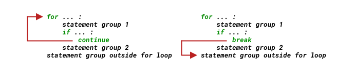

# 流程控制

在相對深入瞭解了值的基本操作之後，我們需要再返回來對流程控製做更深入的瞭解。

之前我們看過這個尋找質數的程序：
```python
for n in range(2, 100):
    if n == 2:
        print(n)
        continue
    for i in range(2, n):
        if (n % i) == 0:
            break
    else:
        print(n)  
```
這其中，包含了_分支_與_循環_ —— 無論多複雜的流程控制用這兩個東西就夠了，就好像無論多複雜的電路最終都是由通路和開路僅僅兩個狀態構成的一樣。

> 今天的人們覺得這是 “天經地義” 的事情，可實際上並非如此。這是 1966 年的一篇論文所帶來的巨大改變 —— *Communications of the ACM* by Böhm and Jacopini (1966)。實際上，直到上個世紀末，`GOTO` 語句才從各種語言里近乎 “滅絕”……
>
> 任何進步，無論大小，其實都相當不容易，都非常耗時費力 —— 在哪兒都一樣。有興趣、有時間，可以去瀏覽 Wikipedia 上的簡要說明 —— [Wikipedia: Minimal structured control flow](https://en.wikipedia.org/wiki/Control_flow#Goto)。

## if 語句

`if` 語句的最簡單構成是這樣 —— 註意第 1 行末尾的冒號：
```python
if expression:
    statements
```
如果表達式 `expression` 返回值為真，執行 `if` 語句塊內部的 `statements`，否則，什麼都不做，執行 `if` 之後的下一個語句。
```python
import random
r = random.randrange(1, 1000)

if r % 2 == 0:
    print(f'{r} is even.')
```
如果，表達式 `expression` 返回值無論真假，我們都需要做一點相應的事情，那麼我們這麼寫：
```python
if expression:
    statements_for_True
else:
    statements_for_False
```
如果表達式 `expression` 返回值為真，執行 `if` 語句塊內部的 `statements_for_True`，否則，就執行 `else` 語句塊內部的 `statements_for_False`
```python
import random
r = random.randrange(1, 1000)

if r % 2 == 0:
    print(f'{r} is even.')
else:
    print(f'{r} is odd.')
```
    126 is even.


有時，表達式 `<expression>` 返回的值有多種情況，並且針對不同的情況我們都要做相應的事情，那麼可以這麼寫：
```python
if expression_1:
    statements_for_expression_1_True
    
elif expression_2:
    statements_for_expression_2_True

elif expression_3:
    statements_for_expression_3_True

elif expression_...:
    statements_for_expression_..._True
```
Python 用 `elif` 處理這種多情況分支，相當於其它編程語言中使用 `switch` 或者 `case`……

`elif` 是 `else if` 的縮寫，作用相同。

以下程序模擬投兩個骰子的結果 —— 兩個骰子數字加起來，等於 `7` 算平，大於 `7` 算大，小於 `7` 算小：
```python
import random
r = random.randrange(2, 13)

if r == 7:
    print('Draw!')
elif r < 7:
    print('Small!')
elif r > 7:
    print('Big!')
```
    Big!


當然你還可以模擬投飛了的情況，即，最終的骰子數是 `0` 或者 `1`，即，`< 2`：
```python
import random
r = random.randrange(0, 13) # 生成的隨機數應該從 0 開始了；

if r == 7:
    print('Draw!')
elif r >= 2 and r < 7:      # 如果這裡直接寫 elif r < 7: ，那麼，else: 那一部分永遠不會被執行……
    print('Small!')
elif r > 7:
    print('Big!')
else:
    print('Not valid!')
```
    Small!


## for 循環

Python 語言中，`for` 循環不使用其它語言中那樣的計數器，取而代之的是 `range()` 這個我稱其為 “整數等差數列生成器” 的函數。

用 C 語言寫循環是這樣的：
```C
for( a = 0; a < 10; a = a + 1 ){
    printf("value of a: %d\n", a);
}
```
用 Python 寫同樣的東西，是這樣的：
```python
for a in range(10):
    print(f'value of a: {a}') #每次 a 的值都不同，從 0 遞增至 9
```
    value of a: 0
    value of a: 1
    value of a: 2
    value of a: 3
    value of a: 4
    value of a: 5
    value of a: 6
    value of a: 7
    value of a: 8
    value of a: 9


### range() 函數

`range()` 是個內建函數，[它的文檔](https://docs.python.org/3/library/functions.html#func-range)是這樣寫的：

> **range**(_stop_) 
>
> **range**(_start, stop[, step]_)

只有一個參數的時候，這個參數被理解為 `stop`，生成一個從 `0` 開始，到 `stop - 1` 的整數數列。

這就解釋了為什麼有的時候我們會在 `for ... in range(...):` 這種循環內的語句塊里進行計算的時候，經常會在變量之後寫上 `+ 1`，因為我們 range(n) 的返回數列中不包含 `n`，但我們有時候卻需要 `n`。[點擊這裡返回看看第一章里提到的例子：所謂算法那一小節](Part.1.E.1.entrance.ipynb#plusone)。
```python
from IPython.core.interactiveshell import InteractiveShell
InteractiveShell.ast_node_interactivity = "all"

range(10)
list(range(10)) # 將 range(10) 轉換成 list，以便清楚看到其內容。
```
    range(0, 10)
    [0, 1, 2, 3, 4, 5, 6, 7, 8, 9]


`start` 參數的默認值是 `0`。如需指定起點，那麼得給 `range()` 傳遞兩個參數，比如，`range(2, 13)`……
```python
list(range(2, 13))
```
    [2, 3, 4, 5, 6, 7, 8, 9, 10, 11, 12]


第三個參數可選； `step`，步長，就相當於是 “等差數列” 當中的 “差”，默認值是 `1`。例如，`range(1, 10, 2)` 生成的是這樣一個數列 `[1, 3, 5, 7, 9]`。所以，打印 `0 ～ 10` 之間的所有奇數，可以這樣寫：
```python
for i in range(1, 10, 2):
    print(i)
```
    1
    3
    5
    7
    9


我們也可以生成負數的數列：
```python
list(range(0, -10, -1))
```
    [0, -1, -2, -3, -4, -5, -6, -7, -8, -9]


### Continue、Break 和 Pass

在循環的過程中，還可以用 `continue` 和 `break` 控制流程走向，通常是在某條件判斷發生的情況下 —— 正如你早就見過的那樣：
```python
for n in range(2, 100):
    if n == 2:
        print(n)
        continue
    for i in range(2, n):
        if (n % i) == 0:
            break
    else:
        print(n)  
```
`continue` 語句將忽略其後的語句開始下次循環，而 `break` 語句將從此結束當前循環，開始執行循環之後的語句：




`for` 語句塊還可以附加一個 `else` —— 這是 Python 的一個比較有個性的地方。附加在 `for` 結尾的 `else` 語句塊，_在沒有 `break` 發生的情況下會運行_。
```python
for n in range(2, 100):
    if n == 2:
        print(n)
        continue
    for i in range(2, n):
        if (n % i) == 0:
            break
    else:               # 下一行的 print(n) 事實上屬於語句塊 for i in range(2, n): 
        print(n)        # 整個循環結束，都沒有發生 break 的情況下，才執行一次 print(n)
```
    2
    3
    5
    7
    11
    13
    17
    19
    23
    29
    31
    37
    41
    43
    47
    53
    59
    61
    67
    71
    73
    79
    83
    89
    97


試比較以下兩段代碼：
```python
for n in range(2, 100):
    if n == 2:
        print(n)
        continue
    for i in range(2, n):
        if (n % i) == 0:
            break
    print(n)            # 事實上相當於針對 range(2, 100) 中每個 n 都執行了一次 print(n)
                        # 這個 print(n) 屬於語句塊 for n in range(2, 100): 
```
```python
for n in range(2, 100):
    if n == 2:
        print(n)
        continue
    for i in range(2, n):
        if (n % i) == 0:
            break
        print(n)            # 事實上相當於針對 range(2, n) 中每個 n 都執行了一次 print(n)
```
    2
    3
    5
    5
    5
    7
    7
    7
    7
    7
    9
    11
    11
    11
    11
    ...
    97
    97
    97
    97
    97
    97
    99


`pass` 語句什麼都不乾：

再比如，
```python
def someFunction():
    pass
```
又或者：
```python
for i in range(100):
    pass
    if i % 2 == 0:
        pass
```
換個角度去理解的話可能更清楚：`pass` 這個語句更多是給寫程序的人用的。當你寫程序的時候，你可以用 `pass` 占位，而後先寫別的部分，過後再回來補充本來應該寫在 `pass` 所在位置的那一段代碼。

寫嵌套的判斷語句或循環語句的時候，最常用 `pass`，因為寫嵌套挺費腦子的，一不小心就弄亂了。所以，經常需要先用 `pass` 占位，而後逐一突破。

## while 循環

今天，在絕大多數編程語言中，都提供兩種循環結構：

> * Collection-controlled loops（以集合為基礎的循環）
> * Condition-controlled loops（以條件為基礎的循環）

之前的 `for ... in ...` 就是 Collection-controlled loops；而在 Python 中提供的 Condition-controlled loops 是 `while` 循環。

`while` 循環的格式如下：
```python
while expression:
    statements
```
輸出 1000 以內的斐波那契數列的程序如下：
```python
n = 1000
a, b = 0, 1
while a < n:
    print(a, end=' ')
    a, b = b, a+b
print()
```
    0 1 1 2 3 5 8 13 21 34 55 89 144 233 377 610 987 


`for` 和 `while` 的區別在哪裡？什麼時候應該用哪個？

`for` 更適合處理序列類型的數據（Sequence Type）的迭代，比如處理字符串中的每一個字符 ，比如把 `range()` 返回的數列當作某種序列類型的索引。

`while` 更為靈活，因為它後面只需要接上一個邏輯表達式即可。

## 一個投骰子賭大小的游戲

雖然還不可能隨心所欲寫程序，但是，你現在具備了起碼的 “閱讀能力”。有了以上大概的介紹，你也許可以讀懂一些代碼了 —— 它們在你眼裡再也不是天書了……

以下是一個讓用戶和程序玩擲骰子賭大小的程序。規則如下：

>* 每次計算機隨機生成一個 `2... 12` 之間的整數，用來模擬機器人投兩個骰子的情況；
* 機器人和用戶的起始資金都是 10 個硬幣
* 要求用戶猜大小：
    * 用戶輸入 `b` 代表 “大”；
    * 用戶輸入 `s` 代表 “小”；
    * 用戶輸入 `q` 代表 “退出”；
* 用戶的輸入和隨機產生的數字比較有以下幾種情況：
    * 隨機數小於 `7`，用戶猜小，用戶贏；
    * 隨機數小於 `7`，用戶猜大，用戶輸；
    * 隨機數等於 `7`，用戶無論猜大還是猜小，結局平，不輸不贏；
    * 隨機數大於 `7`，用戶猜小，用戶輸；
    * 隨機數大於 `7`，用戶猜大，用戶贏；
* 游戲結束條件：
    * 機器人和用戶，若任意一方硬幣數量為 `0`，則游戲結束；
    * 用戶輸入了 `q` 主動終止游戲。


```python
from random import randrange

coin_user, coin_bot = 10, 10 # 可以用一個賦值符號分別為多個變量賦值
rounds_of_game = 0

def bet(dice, wager):    # 接收兩個參數，一個是骰子點數，另一個用戶的輸入
    if dice == 7:
        print(f'The dice is {dice};\nDRAW!\n') # \n 是換行符號
        return 0
    elif dice < 7:
        if wager == 's':
            print(f'The dice is {dice};\nYou WIN!\n')
            return 1
        else:
            print(f'The dice is {dice};\nYou LOST!\n')
            return -1
    elif dice > 7:
        if wager == 's':
            print(f'The dice is {dice};\nYou LOST!\n')
            return -1
        else:
            print(f'The dice is {dice};\nYou WIN!\n')
            return 1

while True:         #  除 for 之外的另外一個循環語句
    print(f'You: {coin_user}\t Bot: {coin_bot}')
    dice = randrange(2, 13)   # 生成一個 2 到 12 的隨機數
    wager = input("What's your bet? ")
    if wager == 'q':
        break 
    elif wager in 'bs':  # 只有當用戶輸入的是 b 或者 s 得時候，才 “擲骰子”……
        result = bet(dice, wager)
        coin_user += result    # coin_user += result 相當於 coin_user = coin_user + result
        coin_bot -= result
        rounds_of_game += 1
    if coin_user == 0:
        print("Woops, you've LOST ALL, and game over!")
        break
    elif coin_bot == 0:
        print("Woops, the robot's LOST ALL, and game over!")
        break
   
print(f"You've played {rounds_of_game} rounds.\n")
print(f"You have {coin_user} coins now.\nBye!")
```
## 總結

有控制流，才能算得上是程序。

> * 只處理一種情況，用 `if ... `
> * 處理 `True`/`False` 兩種情況，用 `if ... else ...`
> * 處理多種情況，用 `if ... elif ... elif ... else ...`
> * 迭代有序數據類型，用 `for ... in ...` ，如果需要處理沒有 `break` 發生的情況，用 `for ... else ...`
> * 其它循環，用 `while ...`
> * 與循環相關的語句還有 `continue`、 `break`、 `pass`
> * 函數從控制流角度去看其實就是子程序
