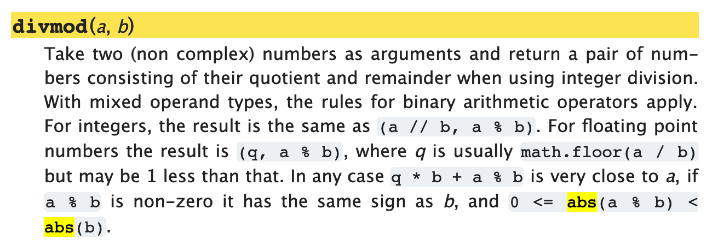
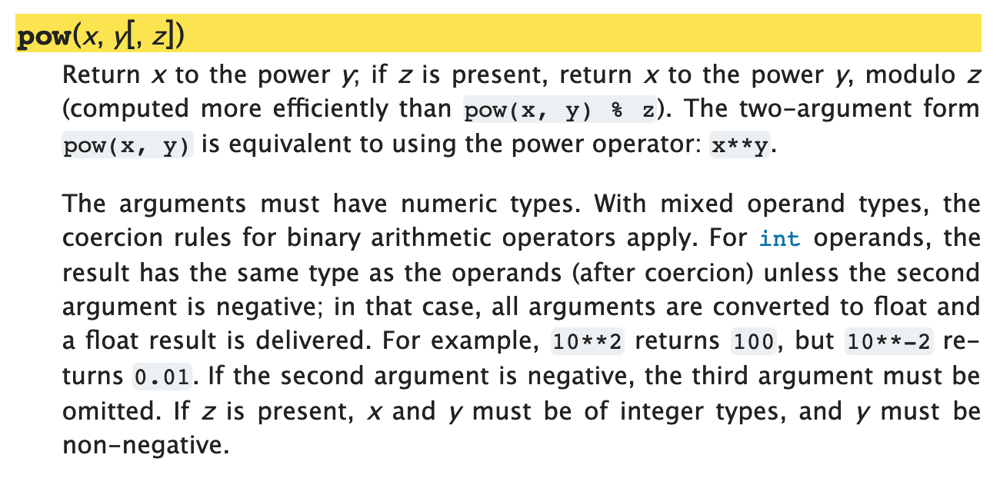
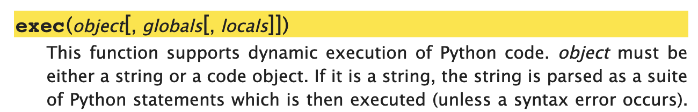
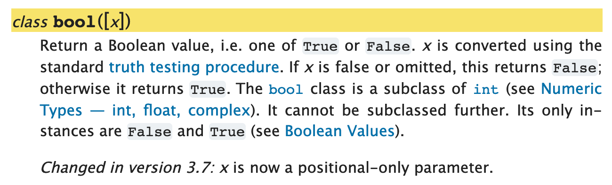

# 函數

函數，實際上是可被調用的完整的程序。它具備輸入、處理、輸出的功能。又因為它經常在主程序里被調用，所以它總是更像是個子程序。

瞭解一個函數，無非是要瞭解它的兩個方面：

> * 它的**輸入**是怎麼構成的（都有哪些參數？如何指定？）；
> * 以及它的**輸出**是什麼（返回值究竟是什麼？）……

從這個角度看，牛，對人類來說就是個函數，它吃的是_草_，擠出來的是*奶*…… 開玩笑了。

在我們使用函數的過程中，我們常常_有意忽略_它的內部如何完成從輸入到輸出之間的_處理過程_ —— 這就好像我們平日里用燈泡一樣，大多數情況下，我們只要知道開關的使用方法就夠了 —— 至於為什麼按到這個方向上燈會亮，為什麼按到另外一個方向上燈會滅，並不是我們作為用戶必須關心的事情…… 

當然，如果你是設計開關的人就不一樣了，你必須知道其中的運作原理；但是，最終，你還是希望你的用戶用最簡單方便的操作界面，而不是必須搞懂所有原理才能夠使用你所設計的產品……

當我們用 Python 編程的時候，更多的情況下，我們只不過是在使用別人已經寫好的函數，或者用更專業一點的詞藻，叫做 “已完好封裝的函數”。而我們所需要做的事情（所謂的 “學習使用函數”），其實只不過是 “通過閱讀產品說明書瞭解如何使用產品” 而已，真的沒多神秘……

**註意**

> 這一章的核心目的，不是讓你學會如何寫函數；而是通過一些例子，讓你大抵上學會 “_如何閱讀官方文檔中關於函數的使用說明_”。也請註意之前的那個詞：“_大抵上_”，所以**千萬別怕自己最初的時候理解不全面**。

另外，這一章中用來舉例的函數，全部來自於同一個官方文檔頁面，[Built-in Functions](https://docs.python.org/3/library/functions.html)：

> https://docs.python.org/3/library/functions.html

## 示例 print()

### 基本的使用方法

`print()` 是初學者最常遇到的函數 —— 姑且不說是不是最常用到的。

它最基本的作用就是把傳遞給它的值輸出到屏幕上，如果不給它任何參數，那麼它就輸出一個空行：
```python
print('line 1st')
print('line 2nd')
print()
print('line 4th')
```
    line 1st
    line 2nd
    
    line 4th


你也可以向它傳遞多個參數，參數之間用 `,` 分開，它就會把那些值逐個輸出到屏幕，每個值之間默認用空格分開。
```python
print('Hello,', 'jack', 'mike', '...', 'and all you guys!')
```
    Hello, jack mike ... and all you guys!


當我們想把變量或者表達式的值插入字符串中的時候，可以用 f-string：
```python
name = 'Ann'
age = '22'
print(f'{name} is {age} years old.')
```
    Ann is 22 years old.


但這並不是 `print()` 這個函數的功能，這實際上是 [`f-string`](https://docs.python.org/3/library/stdtypes.html#printf-style-string-formatting) 的功能，`f-string` 中用花括號 `{}` 擴起來的部分是表達式，最終轉換成字符串的時候，那些表達式的值（而不是變量或者表達式本身）會被插入相應的位置……
```python
name = 'Ann'
age = '22'
f'{name} is {age} years old.'
```
    'Ann is 22 years old.'


所以，`print(f'{name} is {age} years old.')` 這一句中，函數 `print()` 完成的還是它最基本的功能：給它什麼，它就把什麼輸出到屏幕上。

### print() 的官方文檔說明

以下，是 print() 這個函數的[官方文檔](https://docs.python.org/3/library/functions.html#print)：


最必須讀懂的部分，就是這一行：

> `print(*object, sep=' ', end='\n', file=sys.stdout, flush=False)` <a href='#fn1' name='fn1b'><sup>[1]</sup></a>

先只註意那些有著 `=` 的參數，`sep=' '`、`end='\n'`、`file=sys.stdout`，和 `flush=False`。

這其中，先關註這三個 `sep=' '`、`end='\n'`、`file=sys.stdout`：

> * `sep=' '`：接收多個參數之後，輸出時，分隔符號默認為空格，`' '`；
> * `end='\n'`：輸出行的末尾默認是換行符號 `'\n'`；
> * `file=sys.stdout`：默認的輸出對象是 `sys.stdout`（即，用戶正在使用的屏幕）……

也就是說，這個函數中有若干個具有默認值的參數，即便我們在調用這個函數的時候，就算沒有指定它們，它們也存在於此。

即，當我們調用 `print('Hello', 'world!')` 的時候，相當於我們調用的是 `print('Hello', 'world!', sep=' ', end='\n', file=sys.stdout, flush=False)`
```python
import sys                                  # 如果沒有這一行，代碼會報錯

print('Hello', 'world!')                    # 下一行的輸出和這一行相同
print('Hello', 'world!', sep=' ', end='\n', file=sys.stdout, flush=False)
print('Hello', 'world!', sep='-', end='\t')
print('Hello', 'world!', sep='~')           # 上一行的末尾是 \t，所以，這一行並沒有換行顯示
print('Hello', 'world!', sep='\n')          # 參數之間用換行 \n 分隔 
```
    Hello world!
    Hello world!
    Hello-world!	Hello~world!
    Hello
    world!


很多人只看各種教材、教程，卻從來不去翻閱官方文檔 —— 到最後非常吃虧。只不過是多花一點點的功夫而已，看過之後，就會知道：原來 `print()` 這個函數是可以往文件里寫數據的，只要指定 `file` 這個參數為一個已經打開的文件對象就可以了（真的有很多人完全不知道）……

另外，現在可以說清楚了：

> `print()` 這個函數的返回值是 `None` —— 註意，它向屏幕輸出的內容，與 `print()` 這個函數的返回值不是一回事。

做為例子，看看 `print(print(1))` 這個語句 —— `print()` 這個函數被調用了兩次，第一次是 `print(1)`，它向屏幕輸出了一次，完整的輸出值實際上是 `str(1) + '\n'`，而後返回一個值，`None`；而第二次調用 print()，這相當於是向屏幕輸出這個 `None`：
```python
print(print(1))
```
    1
    None


“**看說明書**” 就是這樣，全都看了，真不一定全部看懂，但看總是比不看強，因為總是有能看懂的部分……

## 關鍵字參數

在 Python 中，函數的參數，有兩種：
> * **位置參數**（Positional Arguments，在官方文檔里常被縮寫為 *arg*）
> * **關鍵字參數**（Keyword Arguments，在官方文檔里常被縮寫為 *karg*）

在函數定義中，帶有 `=` 的，即，已為其設定了默認值的參數，叫做 Keyword Arguments，其它的是 Positional Arguments。

在調用有 Keyword Arguments 的函數之時，如若不提供這些參數，那麼參數在執行時，啟用的是它在定義的時候為那些 Keyword Arguments 所設定的默認值；如若提供了這些參數的值，那麼參數在執行的時候，啟用的是接收到的相應值。

比如，`sorted()` 函數，它的定義如下：

> `sorted(iterable, *, key=None, reverse=False)`

現在先只關註它的 Keyword Arguments，`reverse`：
```python
from IPython.core.interactiveshell import InteractiveShell
InteractiveShell.ast_node_interactivity = "all"

sorted('abdc')
sorted('abdc', reverse=True)
```
    ['a', 'b', 'c', 'd']
    ['d', 'c', 'b', 'a']


## 位置參數

位置參數，顧名思義，是 “由位置決定其值的參數”。拿 `divmod()` 為例，它的[官方文檔](https://docs.python.org/3/library/functions.html#divmod)是這樣寫的：



它接收且必須接收兩個參數。

> * 當你調用這個函數的時候，括號里寫的第一個參數，是被除數，第二個參數是除數 —— 此為該函數的輸入；
> * 而它的返回值，是一個元組（Tuple，至於這是什麼東西，後面講清楚），其中包括兩個值，第一個是商，第二個是餘 —— 此為該函數的輸出。

作為 “這個函數的用戶”，你不能（事實上也沒必要）調換這兩個參數的意義。因為，根據定義，被傳遞的值的意義就是由參數的位置決定的。
```python
from IPython.core.interactiveshell import InteractiveShell
InteractiveShell.ast_node_interactivity = "all"

divmod(11, 3)
a, b = divmod(11, 3)
a
b

divmod(3, 11)
a, b = divmod(3, 11)
a
b
```
    (3, 2)
    3
    2
    (0, 3)
    0
    3


## 可選位置參數

有些函數，如 `pow()`，有**可選的位置參數**（Optional Positional Arguments）。



於是，`pow()` 有兩種用法，各有不同的結果：

> * `pow(x, y)` —— 返回值是 `x ** y`
> * `pow(x, y, z)` —— 返回值是 `x ** y % z`


```python
from IPython.core.interactiveshell import InteractiveShell
InteractiveShell.ast_node_interactivity = "all"

pow(2, 3)
pow(2, 3, 4)
```
    8
    0


註意 `pow()` 函數定義部分中，圓括號內的方括號 `[, z]` —— 這是非常嚴謹的標註，如果沒有 `z`，那麼那個逗號 `,` 就是沒必要的。

看看 `exec()` 的官方文檔（先別管這個函數幹嘛用的），註意函數定義中的兩個嵌套的方括號：



這些方括號的意思是說：

> * 沒在方括號里的 `object` 是不可或缺的函數，調用時必須提供；
> * 可以有第二個參數，第二個參數會被接收為 `globals`；
> * 在有第二個參數的情況下，第三個參數會被接收為 `locals`；
> * *但是，你沒辦法在不指定 `globals` 這個位置參數的情況下指定 `locals`……*

## 可接收很多值的位置參數

再回頭看看 `print()`，它的第一個位置參數，`object` 前面是有個星號的：`*object, ...`。

對函數的用戶來說，這說明，這個位置可以接收很多個參數（或者說，這個位置可以接收一個列表或者元組）。

再仔細看看 `print()`，它只有一個位置參數：


因為位置決定了值的定義，一般來說，一個函數里最多只有一個這種可以接收很多值的位置參數 —— 否則如何獲知誰是誰呢？

如果與此同時，還有若干個位置參數，那麼，*能夠接收很多值的位置參數*只能放置最後，就好像 `max()` 函數那樣：


## Class 也是函數

雖然你現在還不一定知道 Class 究竟是什麼，但在閱讀官方文檔的時候，遇到一些內建函數前面寫著 Class，比如 `Class bool([x])`，千萬別奇怪，因為 Class 本質上來看就是一種特殊類型的函數，也就是說，它也是函數：


```python
from IPython.core.interactiveshell import InteractiveShell
InteractiveShell.ast_node_interactivity = "all"

bool()
bool(3.1415926)
bool(-3.1415926)
bool(1 == 2)
bool(None)
```
    False
    True
    True
    False
    False


## 總結

本章需要（大致）瞭解的重點如下，其實很簡單：

> * 你可以把函數當作一個產品，而你自己是這個產品的用戶；
> * 既然你是產品的用戶，你要養成好習慣，一定要親自閱讀產品說明書；
> * 調用函數的時候，註意_可選位置參數的使用方法_和_關鍵字參數的默認值_；
> * 函數定義部分，註意兩個符號就行了，`[]` 和 `=`；
> * 所有的函數都有返回值，即便它內部不指定返回值，也有一個默認返回值：`None` ；
> * 另外，一定要耐心閱讀該函數在使用的時候需要註意什麼 —— 產品說明書的主要作用就在這裡……

知道這些就很好了！

這就好像你拿著一張地圖，不可能一下子掌握其中所有的細節，但花幾分鐘搞清楚 “圖例”（Legend）部分總是可以的，知道什麼樣的線標示的是公交車，什麼樣的線標示的是地鐵，什麼樣的線標示的是橋梁，然後知道上北下南左西右東 —— 這之後，就可以開始慢慢研究地圖了……

為了學會使用 Python，你以後最常訪問的頁面一定是這個：

> * https://docs.python.org/3/library/index.html
>
>   而最早反覆閱讀查詢的頁面肯定是其中的這兩個：
>   * https://docs.python.org/3/library/functions.html
>   * https://docs.python.org/3/library/stdtypes.html

對了，還有就是，在這一章之後，你已經基本上 “**精通**” 了 `print()` 這個函數的用法。

-----
**腳註**

（2019.02.14）<a name='fn1'>[1]</a>：`print()` 函數的[官方文檔](https://docs.python.org/3/library/functions.html#print)里，`sep=''` 肯定是 `sep=' '` 的筆誤 —— 可以用以下代碼驗證：
```python
print('a', 'b', sep='')
print('a', 'b')
```
（2019.03.16）有讀者提醒：https://github.com/selfteaching/the-craft-of-selfteaching/issues/111

> 而現在（2019.03.16）複製粘貼文檔中的 `sep=' '`，會發現是有空格的。
>
> 這是改了麽？

我回去查看了一下 2019.02.13 我提交的 bug track：[https://bugs.python.org/issue35986](https://bugs.python.org/issue35986) ，結論是 “人家沒問題，是我自己的瀏覽器字體設置有問題”…… 

然而，我決定將這段文字保留在此書里，以便人們看到 “平日里軟件維護是什麼樣的” —— 作為一個實例放在這裡，很好。

<a href='#fn1b'><small>↑Back to Content↑</small></a>

