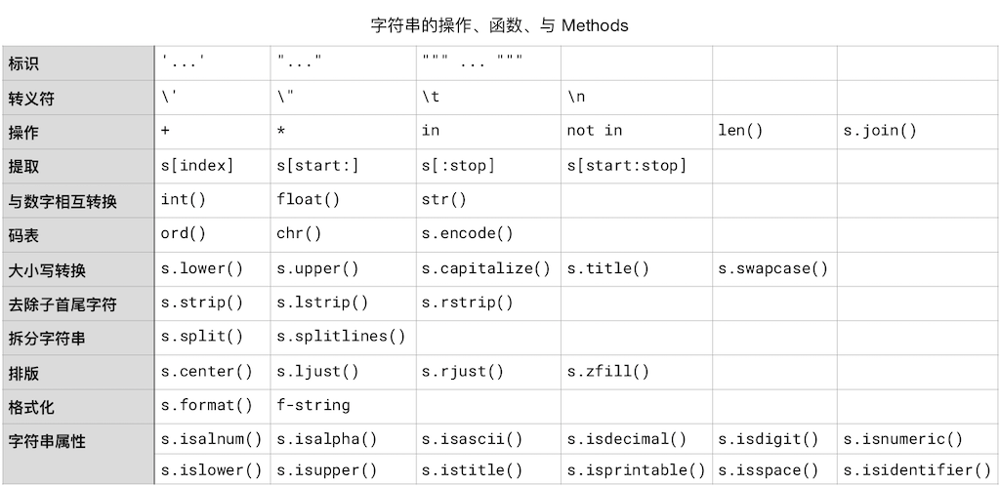

# 字符串

在任何一本編程書籍之中，關於字符串的內容總是很長 —— 就好像每本英語語法書中，關於動詞的內容總是占全部內容的至少三分之二。這也沒什麼辦法，因為處理字符串是計算機程序中最普遍的需求 —— 因為程序的主要功能就是完成人機交互，人們所用的就是字符串而不是二進制數字。

在計算機里，所有的東西最終都要被轉換成數值。又由於計算機靠的是電路，所以，最終只能處理 `1` 和 `0`，於是，最基本的數值是二進制；於是，連整數、浮點數字，都要最終轉換成二進制數值。這就是為什麼在所有編程語言中 `1.1 + 2.2` 並不是你所想象的 `3.3` 的原因。
```python
1.1 + 2.2
```
    3.3000000000000003


因為最終所有的值都要轉換成二進制 —— 這時候，小數的精度就有損耗，多次浮點數字轉換成二進制相互運算之後再從二進制轉換為十進制之後返回的結果，精度損耗就更大了。因此，在計算機上，浮點數字的精度總有極限。有興趣進一步可以看看[關於 decimal 模塊的文檔](https://docs.python.org/3/library/decimal.html)。

字符串也一樣。一個字符串由 0 個字符或者多個字符構成，它最終也要被轉換成數值，再進一步被轉換成二進制數值。空字符串的值是 `None`，即便是這個 `None` —— 也最終還是要被轉換成二進制的 `0`。

## 字符碼表的轉換

很久以前，計算機的中央處理器最多只能夠處理 8 位二進制數值，所以，那時候的計算機只能處理 256 個字符，即，2<sup>8</sup> 個字符。那個時候計算機所使用的碼表叫 ASCII。現在計算機的中央處理器，大多是 64 位的，所以可以使用 2<sup>64</sup> 容量的碼表，叫做 [Unicode](https://zh.wikipedia.org/wiki/Unicode)。隨著多年的收集，2018 年 6 月 5 日公佈的 `11.0.0` 版本已經包含了 13 萬個字符 —— 突破 10 萬字符是在 2005 年<a href='#fn1' name='fn1b'><sup>[1]</sup></a>。


把單個字符轉換成碼值的函數是 `ord()`，它只接收單個字符，否則會報錯；它返回該字母的  unicode 編碼。與 `ord()` 相對的函數是 `chr()`，它接收且只接收一個整數作為參數，而後返回相應的字符。`ord()` 接收多個字符的話會報錯。
```python
from IPython.core.interactiveshell import InteractiveShell
InteractiveShell.ast_node_interactivity = "all"

ord('a')
chr(122)

ord('氅')  # 完了，漢字也有你不認識的吧？
chr(25354) # 這個字估計你也不認識……

# ord('Python') # 這一句會報錯
```
    '挊'


## 字符串的標示

標示一個字符串，有 4 種方式，用單引號、用雙引號，用三個單引號或者三個雙引號：
```python
'Simple is better than complex.' # 用單引號
```
    'Simple is better than complex.'


```python
"Simple is better than complex." # 用雙引號
```
    'Simple is better than complex.'


```python
# 用三個單引號。註意輸出結果中的 \n
# 這個字符串，看起來是兩行，保存在內存或者變量之中的時候，
# 是一整串，其中的換行是用 \n 表示的。
'''
Simple is better than complex.
Complex is better than complicated.
''' 
```
    '\nSimple is better than complex.\nComplex is better than complicated.\n'


```python
#用三個雙引號。註意輸出結果中的 \n
"""
Simple is better than complex.
Complex is better than complicated.
""" 
```
    '\nSimple is better than complex.\nComplex is better than complicated.\n'


```python
print(
"""
Simple is better than complex.
Complex is better than complicated.
"""
) #用 print() 輸出的時候，\n 就是不可見字符，字符串本身如下：
# '\nSimple is better than complex.\nComplex is better than complicated.\n'
# 其中的 \n 被打印出來的時候顯示成換行
```

    Simple is better than complex.
    Complex is better than complicated.


## 字符串與數值之間的轉換

由數字構成的字符串，可以被轉換成數值，轉換整數用 `int()` ，轉換浮點數字用 `float()`。

與之相對，用 `str()`，可以將數值轉換成字符串類型。

註意，int() 在接收字符串為參數的時候，只能做整數轉換。下麵代碼最後一行會報錯：
```python
from IPython.core.interactiveshell import InteractiveShell
InteractiveShell.ast_node_interactivity = "all"

int('3')
float('3')
str(3.1415926)
# int('3.1415926') # 這一行會報錯
```
    3
    3.0
    '3.1415926'


`input()` 這個內建函數的功能是接收用戶的鍵盤輸入，而後將其作為字符串返回。它可以接收一個字符串作為參數，在接收用戶鍵盤輸入之前，會把這個參數輸出到屏幕，作為給用戶的提示語。這個參數是可選參數，直接寫 `input()`，即，沒有提供參數，那麼它在要求用戶輸入的時候，就沒有提示語。

以下代碼會報錯，因為 `age < 18` 不是合法的邏輯表達式，因為 `age` 是由 `input()` 傳遞過來的字符串；於是，它不是數字，那麼它不可以與數字比較……
```python
age = input('Please tell me your age: ')
if age < 18:
    print('I can not sell you drinks...')
else:
    print('Have a nice drink!')
```
    Please tell me your age:  19
    ---------------------------------------------------------------------------
    TypeError                                 Traceback (most recent call last)
    <ipython-input-9-0573fe379e83> in <module>
          1 age = input('Please tell me your age: ')
    ----> 2 if age < 18:
          3     print('I can not sell you drinks...')
          4 else:
          5     print('Have a nice drink!')
    TypeError: '<' not supported between instances of 'str' and 'int'

要改成這樣才可能行：
為什麼是可能行而不是一定行？如果用戶 `input` 鍵盤輸入的是 `eighteen` 或者 ` 十八 ` 等，依然會導致 `int()` 失敗並得到 `ValueError` 的報錯。用戶輸入的不可控，可能會導致千奇百怪的報錯。但在這裡，我們先簡化處理，在引導語中加入一個正確的示例並默認用戶會按引導語正確輸入。

```python
age = int(input('Please tell me your age: 
 an int number , e.g: 22
'))
if age < 18:
    print('I can not sell you drinks...')
else:
    print('Have a nice drink!')
```
    Please tell me your age:  19
    Have a nice drink!


**註意**：如果你用來瀏覽當前 `.ipynb` 文件的是那個桌面 App [Nteract](https://nteract.io/)，它目前不支持 input() 這個函數的調用……

## 轉義符

有一個重要的字符，叫做 “轉義符”，`\`，也有的地方把它稱為 “脫字符”，因為它的英文原文是 _Escaping Character_。它本身不被當作字符，你要想在字符串里含有這個字符，得這樣寫 `\\`：
```python
'\\'
```
    '\\'


```python
'\'
```
      File "<ipython-input-10-d44a383620ab>", line 1
        '\'
           ^
    SyntaxError: EOL while scanning string literal


上面這一行報錯信息是 `SyntaxError: EOL while scanning string literal`。這是因為 `\'` 表示的是單引號字符 `'`（Literal） —— 是可被輸出到屏幕的 `'`，而不是用來標示字符串的那個 `'` —— 別急，無論哪個初學者第一次讀到前面的句子都覺得有點莫名其妙…… —— 於是，Python 編譯器掃描這個 “字符串” 的時候，還沒找到標示字符串末尾的另外一個 `'` 的時候就讀到了 `EOL`（End Of Line）。

如果你想輸出這麼個字符串，`He said, it's fine.`，如果用雙引號擴起來 `"` 倒沒啥問題，但是如果用單引號擴起來就麻煩了，因為編譯器會把 `it` 後面的那個單引號 `'` 當作字符串結尾。
```python
'He said, it's fine.'
```
      File "<ipython-input-11-2bcf2ca6dd95>", line 1
        'He said, it's fine.'
                     ^
    SyntaxError: invalid syntax


於是你就得用轉義符 `\`：
```python
from IPython.core.interactiveshell import InteractiveShell
InteractiveShell.ast_node_interactivity = "all"

# 要麼你這麼寫：
'He said, it\'s fine.'
# 要麼你這麼寫：
"He said, it's fine."
# 要麼，不管用單引號還是雙引號標示字符串，都習慣於用 \' 和 \" 書寫屬於字符串內部的引號……
"He said, it\'s fine."
```
    "He said, it's fine."
    "He said, it's fine."
    "He said, it's fine."


轉義符號 `\` 的另外兩個常用形式是和 `t`、`n` 連起來用，`\t` 代表製表符（就是用 TAB `⇥` 鍵敲出來的東西），`\n` 代表換行符（就是用 Enter `⏎` 敲出來的東西）。

由於歷史原因，Linux/Mac/Windows 操作系統中，換行符號的使用各不相同。Unix 類操作系統（包括現在的 MacOS），用的是 `\n`；Windows 用的是 `\r\n`，早期蘋果公司的 Macintosh 用的是 `\r`（參見 [Wikipedia: Newline](https://en.wikipedia.org/wiki/Newline)）。

所以，一個字符串，有兩種形式，**raw** 和 **presentation**，在後者中，`\t` 被轉換成製表符，`\n` 被轉換成換行。

在寫程序的過程中，我們在代碼中寫的是 _raw_，而例如當我們調用 `print()` 將字符串輸出到屏幕上時，是 _presentation_：
```python
s = "He said, it's fine." # raw
print(s)                   # presentation
```
    He said, it's fine.


以後有時間去看看這兩個內建函數，能瞭解更多細節：
> * **ascii**(_object_) https://docs.python.org/3/library/functions.html#ascii
> * **repr**(_object_) https://docs.python.org/3/library/functions.html#repr

## 字符串的操作符

字符串可以用空格 `' '` 或者 `+` 拼接：
```python
'Hey!' + ' ' + 'You!' # 使用操作符 +
```
    'Hey! You!'


```python
'Hey!' 'You!' # 空格與 + 的作用是相同的。
```
    'Hey!You!'


字符串還可以與整數被操作符 `*` 操作，`'Ha' * 3` 的意思是說，把字符串 `'Ha'` 複製三遍：
```python
'Ha' * 3
```
    'HaHaHa'


```python
'3.14' * 3
```
    '3.143.143.14'


字符串還可以用 `in` 和 `not in` 操作符 —— 看看某個字符或者字符串是否被包含在某個字符串中，返回的是布爾值：
```python
'o' in 'Hey, You!'
```
    True


## 字符串的索引

字符串是由一系列的字符構成的。在 Python 當中，有一個容器（Container）的概念，這個概念前面提到過，後面還會深入講解。現在需要知道的是，字符串是容器的一種；容器可分為兩種，有序的和無序的 —— 字符串屬於**有序容器**。

字符串里的每個字符，對應著一個從 `0` 開始的索引。比較有趣的是，索引可以是負數：


| 0    | 1    | 2    | 3    | 4    | 5    |
| ---- | ---- | ---- | ---- | ---- | ---- |
| P    | y    | t    | h    | o    | n    |
| -6   | -5   | -4   | -3   | -2   | -1   |
```python
s = 'Python'
for char in s:
    print(s.index(char), char)
```
    0 P
    1 y
    2 t
    3 h
    4 o
    5 n


對於有序容器中的元素 —— 字符串就是字符的有序容器 —— 由於它們是有索引的，所以我們可以根據索引提取容器中的值，你可以把 `[]` 當作是有序容器的操作符之一，我們姑且將其稱為 “_索引操作符_”。註意以下代碼第 3 行中， `s` 後面的 `[]`，以及裡面的變量 `i`：
```python
s = 'Python'
for i in range(len(s)):
    print(s[i])

#上面的代碼僅是為了演示索引操作符的使用，更簡潔的寫法是：
for i in s:
    print(i)
```
    P
    y
    t
    h
    o
    n


我們可以使用_索引操作符_根據_索引_**提取**字符串這個_有序容器_中的_一個或多個元素_，即，其中的字符或字符串。這個 “提取” 的動作有個專門的術語，叫做 “Slicing”（切片）。索引操作符 `[]` 中可以有一個、兩個或者三個整數參數，如果有兩個參數，需要用 `:` 隔開。它最終可以寫成以下 4 種形式：

> * `s[index]` —— 返回索引值為 `index` 的那個字符
> * `s[start:]` —— 返回從索引值為 `start` 開始一直到字符串末尾的所有字符
> * `s[start:stop]` —— 返回從索引值為 `start` 開始一直到索引值為 `stop` 的那個字符_之前_的所有字符
> * `s[:stop]` —— 返回從字符串開頭一直到索引值為 `stop` 的那個字符_之前_的所有字符
> * `s[start:stop:step]` —— 返回從索引值為 `start` 開始一直到索引值為 `stop` 的那個字符_之前_的，以 `step` 為步長提取的所有字符

提醒：無論是 `range(1,2)`，或者 `random.randrange(100, 1000)` 又或者 `s[start:stop]` 都有一個相似的規律，包含左側的 `1`, `100`, `start`，不包含右側的 `2`, `1000`, `stop`。

```python
from IPython.core.interactiveshell import InteractiveShell
InteractiveShell.ast_node_interactivity = "all"

s = 'Python'
s[1]
s[2:]
s[2:5]
s[:5]
s[1:5:2]
```
    'y'
    'thon'
    'tho'
    'Pytho'
    'yh'


## 處理字符串的內建函數

[Python 內建函數](https://docs.python.org/3/library/functions.html#slice)中，把字符串當做處理對象的有：`ord()`、`input()`、`int()`、`float()`、`len()`、`print()`。再次註意，`ord()` 只接收單個字符為參數。
```python
from IPython.core.interactiveshell import InteractiveShell
InteractiveShell.ast_node_interactivity = "all"

ord('\n')
ord('\t')
ord('\r')
chr(65) # 與 ord() 相對的函數
s = input('請照抄一遍這個數字 3.14: ')
int('3')
# int(s) 這一句會報錯…… 所以暫時註釋掉了
float(s) * 9
len(s)
print(s*3)
```
    10
    9
    13
    'A'
    請照抄一遍這個數字 3.14:  3.14
    3
    28.26
    4
    3.143.143.14


## 處理字符串的 Method

在 Python 中，字符串是一個**對象** —— 更準確地講，是 str 類（`Class str`）的對象。

第一部分尚未讀完的你，暫時不用瞭解對象究竟是什麼；只需要知道的是，一個對象的內部有很多函數…… 這些寫在對象內部的函數，有個專門的名稱，類的**方法**（Method）。問題在於，在講解編程的內容里，“方法” 這個詞（比如，處理數值的_方法_是……）隨處可見；所以，**為了避免歧義**，以後的文字里，提到 “類的方法” 的時候，直接用 **Method** 這個英文單詞……

字符串有很多可以調用 Methods。以下介紹的 `str` Methods，在官方文檔 "[Text Sequence Type](https://docs.python.org/3/library/stdtypes.html#text-sequence-type-str)" 中都可以找到。

調用 str 類的 Methods 是使用 `.` 這個符號，比如：
```python
'Python'.upper()
```
### 大小寫轉換

轉換字符串大小寫的是 `str.upper()`、 `str.lower()` 和 `str.swapcase()`，以及 `str.casefold()`；另外，還有專門針對行首字母大寫的 `str.capitalize()` 和針對每個詞的首字母大寫的 `str.title()`：
```python
from IPython.core.interactiveshell import InteractiveShell
InteractiveShell.ast_node_interactivity = "all"

'Now is better than never.'.upper()

# 在 Python 命令行工具之中，單個下劃線，是個特殊變量；
# 保存著最近的語句或者表達式的結果
# 上一個 Cell 執行過後，_ 中保存著 'NOW IS BETTER THAN NEVER.'

_.lower()
```
    'NOW IS BETTER THAN NEVER.'
    'now is better than never.'


```python
from IPython.core.interactiveshell import InteractiveShell
InteractiveShell.ast_node_interactivity = "all"

# casefold() 也是轉換成小寫，但它能處理更多歐洲語言字符

'ß'.casefold()           # 德語字符中，大寫 ß 的小寫形式是 ss
len('ß'.casefold())
'ß'.lower()              # lower() 對這類字符無能為力……
len('ß'.lower())
# casefold 
'\u0132'                # IJ 這個字符的 Unicode 編碼
'\u0132'.casefold()
'\u0132'.lower()        # 對這個字符來說，lower() 和 casefold 的效果一樣
len('\u0132'.casefold())

# 這是一篇有用的文章：
# Truths programmers should know about case
# https://www.b-list.org/weblog/2018/nov/26/case/
```
    'ss'
    2
    'ß'
    1
    'IJ'
    'ij'
    'ij'
    1


```python
from IPython.core.interactiveshell import InteractiveShell
InteractiveShell.ast_node_interactivity = "all"

s = 'Now is better than never.'
s.capitalize() # 句首字母大寫
s.title() # 每個單詞首字母大寫
```
    'Now is better than never.'
    'Now Is Better Than Never.'


```python
s = 'Now is better than never.'
s.swapcase() # 逐個字符更替大小寫
s.title() 
s.title().swapcase() 
```
    'nOW IS BETTER THAN NEVER.'
    'Now Is Better Than Never.'
    'nOW iS bETTER tHAN nEVER.'


另外，還有個 `str.encode()` 在處理非英文字符串（比如中文）的時候，經常會用到：
```python
# str.encode(encoding="utf-8", errors="strict")
# 關於更多可能的 encoding list, 請參閱：
# https://docs.python.org/3/library/codecs.html#standard-encodings
s = '簡單優於複雜。'
s.encode()
```
    b'\xe7\xae\x80\xe5\x8d\x95\xe4\xbc\x98\xe4\xba\x8e\xe5\xa4\x8d\xe6\x9d\x82\xe3\x80\x82'


### 搜索與替換

讓我們從 `str.count()` 這個搜尋子字符串出現次數的 Method（即，`str` 這個 `Class` 中定義的函數）開始。

它官方文檔是這麼寫的：

> `str.count(sub[,start[,end]])`

下麵的函數說明加了默認值，以便初次閱讀更容易理解：

> `str.count(sub [,start=0[, end=len(str)-1]])`

這裡的方括號 `[]` 表示該參數可選；方括號里再次嵌套了一個方括號，這個意思是說，在這個可選參數 `start` 出現的情況下，還可以再有一個可選參數 `end`；

而 `=` 表示該參數有個默認值。上述這段說明如果你感到熟悉的話，說明前面的內容確實閱讀到位了……與大量 “前置引用” 相伴隨的是知識點的重覆出現。

> * 只給定 `sub` 一個參數的話，於是從第一個字符開始搜索到結束；
> * 如果，隨後給定了一個可選參數的話，那麼它是 `start`，於是從 `start` 開始，搜索到字符串結束；
> * 如果 `start` 之後還有參數的話，那麼它是 `end`；於是從 `start` 開始，搜索到 `end` 結束。
> 
> 返回值為在字符串中 `sub` 出現的次數。

註意：字符串中第一個字符的索引值是 `0`。


```python
from IPython.core.interactiveshell import InteractiveShell
InteractiveShell.ast_node_interactivity = "all"

s = """Simple is better than complex.
Complex is better than complicated."""
s.lower().count('mp')
s.lower().count('mp', 10)
s.lower().count('mp', 10, 30)
```
    4
    3
    1


以下是 `str` 的搜索與替換的 Methods： `str.find()`, `str.rfind()`, `str.index()` 的示例：
```python
from IPython.core.interactiveshell import InteractiveShell
InteractiveShell.ast_node_interactivity = "all"

# str.find(sub[, start[, end]])
print('Example of str.find():')
s = """Simple is better than complex.
Complex is better than complicated."""
s.lower().find('mpl')
s.lower().find('mpl', 10)
s.lower().find('mpl', 10, 20) # 沒有找到就返回 -1
print()

print('Example of str.rfind():')
# str.rfind(sub[, start[, end]])
# rfind() 返回最後 sub 出現的那次的位置；find()是最早的那次
s.lower().rfind('mpl')
s.lower().rfind('mpl', 10)
s.lower().rfind('mpl', 10, 20) # 沒有找到就返回 -1
print()

print('Example of str.index():')
# str.index(sub[, start[, end]])
# 作用與 find() 相同，但如果沒找到的話，會觸發 ValueError 異常
# https://docs.python.org/3/library/exceptions.html#ValueError
s.lower().index('mpl')
# str.rindex(sub[, start[, end]])
# 作用與 rfind() 相同，但如果沒找到的話，會觸發 ValueError 異常
s.lower().rindex('mpl')
print()
```
    Example of str.find():
    2
    24
    -1
    
    Example of str.rfind():
    56
    56
    -1
    
    Example of str.index():
    2
    56


`str.startswith()` 和 `str.endswith()` 是用來判斷一個_字符串_是否以某個_子字符串_起始或者結束的：
```python
s = """Simple is better than complex.
Complex is better than complicated."""

# str.startswith(prefix[, start[, end]])
print("s.lower().startswith('S'):", \
      s.lower().startswith('S'))
print("s.lower().startswith('b'):", \
      s.lower().startswith('b', 10))
print("s.lower().startswith('e', 11, 20):", \
      s.lower().startswith('e', 11, 20))

# str.endswith(suffix[, start[, end]])
print("s.lower().endswith('.'):", \
      s.lower().endswith('.'))
print("s.lower().endswith('.', 10):", \
      s.lower().endswith('.', 10))
print("s.lower().endswith('.', 10, 20):", \
      s.lower().endswith('.', 10, 20))

# 好玩：中國人一不小心就會把這兩個函數寫成或者記成
# startwith() 和 endwith() —— 少寫一個 s!
```
    s.lower().startswith('S'): False
    s.lower().startswith('b'): True
    s.lower().startswith('e', 11, 20): True
    s.lower().endswith('.'): True
    s.lower().endswith('.', 10): True
    s.lower().endswith('.', 10, 20): False


為了找到位置而進行搜索之前，你可能經常需要事先確認需要尋找的字符串在尋找對象中是否存在，這個時候，可以用 `in` 操作符：
```python
s = """Simple is better than complex.
Complex is better than complicated."""
# 如果你只想知道 “有沒有”，而無需知道 “在哪裡”，那麼可以用：
print('mpl' in s)
```
    True


能搜索，就應該能替換 —— `str.replace()`，它的函數說明是這樣的：

> `str.replace(old, new[, count])`

用 `new` 替換 `old`，替換 `count` 個實例，其中，`count` 這個參數是可選的。
```python
s = """Simple is better than complex.
Complex is better than complicated."""

# str.startswith(prefix[, start[, end]])
print("s.lower().replace('mp', '[ ]', 2):\n")
print(s.lower().replace('mp', '[ ]', 2))
```
    s.lower().replace('mp', '[ ]', 2):
    
    si[ ]le is better than co[ ]lex.
    complex is better than complicated.


另外，還有個專門替換 TAB（`\t`）的 Method，

> `str.expandtabs( tabsize=8)` 

它的作用非常簡單，就是把字符串中的 TAB（`\t`）替換成空格，默認是替換成 `8` 個空格 —— 當然你也可以指定究竟替換成幾個空格
```python
from IPython.core.interactiveshell import InteractiveShell
InteractiveShell.ast_node_interactivity = "all"

# str.expandtabs(tabsize=8)
s = "Special\tcases\taren't\tspecial\tenough\tto\tbreak\tthe\trules."
s.expandtabs()
s.expandtabs(2)
```
    "Special cases   aren't  special enough  to      break   the     rules."
    "Special cases aren't  special enough  to  break the rules."


### 去除子字符

> `str.strip([chars])`

它最常用的場景是去除一個字符串首尾的所有空白，包括空格、TAB、換行符等等。
```python
from IPython.core.interactiveshell import InteractiveShell
InteractiveShell.ast_node_interactivity = "all"

s = "\r \t Simple is better than complex.    \t \n"
s
s.strip()
```
    '\r \t Simple is better than complex.    \t \n'
    'Simple is better than complex.'


但是，如果給定了一個字符串作為參數，那麼參數字符串中的所有字母都會被當做需要從首尾剔除的對象：
```python
from IPython.core.interactiveshell import InteractiveShell
InteractiveShell.ast_node_interactivity = "all"

s = "Simple is better than complex."
s
s.strip('Six.p')    # p 全部處理完之後，p 並不在首尾，所以原字符串中的 p 字母不受影響；
s.strip('pSix.mle') # 這一次，首尾的 p 被處理了…… 參數中的字符順序對結果沒有影響，換成 Sipx.mle 也一樣……
```
    'Simple is better than complex.'
    'mple is better than comple'
    ' is better than co'


還可以只對左側處理，`str.lstrip()` 或者只對右側處理，`str.rstrip()`
```python
from IPython.core.interactiveshell import InteractiveShell
InteractiveShell.ast_node_interactivity = "all"

# str.lstrip([chars])
s = "Simple is better than complex."
s
s.lstrip('Six.p')    # p 全部處理完之後，p 並不在首部，所以原字符串中的 p 字母不受影響；
s.lstrip('pSix.mle') # 這一次，首部的 p 被處理了…… 參數中的字符順序對結果沒有影響，換乘 Sipx.mle 也一樣……
```
    'Simple is better than complex.'
    'mple is better than complex.'
    ' is better than complex.'


```python
from IPython.core.interactiveshell import InteractiveShell
InteractiveShell.ast_node_interactivity = "all"

# str.rstrip([chars])
s = "Simple is better than complex."
s
s.rstrip('Six.p')    # p 全部處理完之後，p 並不在尾部，所以原字符串中的 p 字母不受影響；
s.rstrip('pSix.mle') # 這一次，尾部的 p 被處理了…… 參數中的字符順序對結果沒有影響，換乘 Sipx.mle 也一樣……
```
    'Simple is better than complex.'
    'Simple is better than comple'
    'Simple is better than co'


### 拆分字符串

在計算機里，數據一般保存在文件之中。計算機擅長處理的是 “格式化數據”，即，這些數據按照一定的格式排列 —— 電子錶格、數據庫，就是一種保存方式。Microsoft 的 Excel 和 Apple 的 Numbers，都可以將表格導出為 `.csv` 文件。這是文本文件，裡面的每一行可能由多個數據構成，數據之間用 `,`（或 `;`、 `\t`）分隔：
```text
Name,Age,Location
John,18,New York
Mike,22,San Francisco
Janny,25,Miami
Sunny,21,Shanghai
```
文本文件中的這樣一段內容，被讀進來之後，保存在某個變量，那麼，那個變量的值長成這個樣子：

> `'Name,Age,Location\nJohn,18,New York\nMike,22,San Francisco\nJanny,25,Miami\nSunny,21,Shanghai'`

我們可以對這樣的字符串進行很多操作，最常用的比如，`str.splitlines()`, `str.split()`；還有個 `str.partition()`，有空的人可以去[官方文檔](https://docs.python.org/3/library/stdtypes.html#str.partition)看看說明。

`str.splitlines()` 返回的是個列表（List）—— 這又是一個前面曾簡要提起過，但會在後面的章節才能詳細講解的概念 —— 由被拆分的每一行作為其中的元素。
```python
from IPython.core.interactiveshell import InteractiveShell
InteractiveShell.ast_node_interactivity = "all"

s = """Name,Age,Location
John,18,New York
Mike,22,San Francisco
Janny,25,Miami
Sunny,21,Shanghai"""

s                 # s 被打印出來的時候，\n 都被轉換成換行了
s.splitlines()    # 註意輸出結果前後的方括號，[]，表示這個返回結果是一個 List
```
    'Name,Age,Location\nJohn,18,New York\nMike,22,San Francisco\nJanny,25,Miami\nSunny,21,Shanghai'
    ['Name,Age,Location',
     'John,18,New York',
     'Mike,22,San Francisco',
     'Janny,25,Miami',
     'Sunny,21,Shanghai']


`str.split()`, 是將一個字符串，根據分隔符進行拆分：

> `str.split(sep=None, maxsplit=-1)`
```python
from IPython.core.interactiveshell import InteractiveShell
InteractiveShell.ast_node_interactivity = "all"

s = """Name,Age,Location
John,18,New York
Mike,22,San Francisco
Janny,25,Miami
Sunny,21,Shanghai"""

r = s.splitlines()[2]   # 取出返回列表中索引值為 2 的那一行
r
r.split()               # 如果沒有給 str.split() 傳遞參數，那麼默認為用 None 分割（各種空白，比如，\t 和 \r 都被當作 None）
r.split(sep=',')        
r.split(',')            # 上一行可以這樣寫。

r.split(sep=',', maxsplit=1)  # 第二個參數指定拆分幾次
# r.split(sep=',', 1)         # 上一行不能這樣寫。
r.split(sep=',', maxsplit=0)  # 0 次，即不拆分
r.split(sep=',', maxsplit=-1) # 默認值是 -1，拆分全部
```
    'Mike,22,San Francisco'
    ['Mike,22,San', 'Francisco']
    ['Mike', '22', 'San Francisco']
    ['Mike', '22', 'San Francisco']
    ['Mike', '22,San Francisco']
    ['Mike,22,San Francisco']
    ['Mike', '22', 'San Francisco']


### 拼接字符串

`str.join()` 是將來非常常用的，它的官方文檔說明卻很少：

> `str.join(_iterable_)`
>
> Return a string which is the concatenation of the strings in iterable. A _[`TypeError`](https://docs.python.org/3/library/exceptions.html#TypeError)_ will be raised if there are any non-string values in iterable, including [`bytes`](https://docs.python.org/3/library/stdtypes.html#bytes) objects. The separator between elements is the string providing this method.

它接收的參數是 [iterable](https://docs.python.org/3/glossary.html#term-iterable)，雖然你還沒辦法知道 iterable 究竟是什麼，但這個 Method 的例子貌似可以看懂（可能你會產生 “那個方括號究竟是乾什麼的” 的疑問，也可能對前面章節提到的列表還有印象）：
```python
s = ''
t = ['P', 'y', 't', 'h', 'o', 'n']
s.join(t)
```
    'Python'


### 字符串排版

將字符串居中放置 —— 前提是設定整行的長度：

> `str.center(width[, fillchar])`

註意，第 2 個參數可選，且只接收單個字符 —— `char` 是 _character_ 的縮寫。
```python
from IPython.core.interactiveshell import InteractiveShell
InteractiveShell.ast_node_interactivity = "all"

s = 'Sparse is better than dense!'
s.title().center(60)
s.title().center(60, '=')
s.title().center(10) # 如果寬度參數小於字符串長度，則返回原字符串


s = 'Sparse is better than dense!'
s.title().rjust(60)
s.title().rjust(60, '.')
```
    '                Sparse Is Better Than Dense!                '
    '================Sparse Is Better Than Dense!================'
    'Sparse Is Better Than Dense!'
    '                                Sparse Is Better Than Dense!'
    '................................Sparse Is Better Than Dense!'


將字符串靠左或者靠右對齊放置：

> * `str.ljust(width)`
> * `str.rjust(width)`

另外，還有個字符串 Method 是，將字符串轉換成左側由 `0` 填充的指定長度字符串。例如，這在批量生成文件名的時候就很有用……
```python
for i in range(1, 11):
    filename = str(i).zfill(3) + '.mp3'
    print(filename)
```
    001.mp3
    002.mp3
    003.mp3
    004.mp3
    005.mp3
    006.mp3
    007.mp3
    008.mp3
    009.mp3
    010.mp3


### 格式化字符串

所謂對字符串進行格式化，指的是將特定變量插入字符串特定位置的過程。常用的 Methods 有兩個，一個是 `str.format()`，另外一個是 `f-string`。

#### 使用 str.format() 

這個 Method 的[官方文檔說明](https://docs.python.org/3/library/stdtypes.html#str.format)，你現在是死活看不懂的：

> `str.format(*args, **kwargs)`

參數前面多了個 `*`…… 沒辦法，現在講不清楚，講了也聽不明白…… 先跳過，以下只關註怎麼用這個 Method。

它的作用是：

> * 在一個字符串中，插入一個或者多個占位符 —— 用大括號 `{}` 括起來；
> * 而後將 `str.format()` 相應的參數，依次插入占位符中；

占位符中可以使用由零開始的索引。
```python
from IPython.core.interactiveshell import InteractiveShell
InteractiveShell.ast_node_interactivity = "all"

name = 'John'
age = 25
'{} is {} years old.'.format(name, age)
# 不寫占位符索引就默認每個占位符的索引從第一個開始是 0, 1, 2 ... (占位符數量 - 1)
# '{} {}'.format(a, b) 和 '{0} {1}'.format(a, b) 是一樣的。

# '{0} is {2} years old.'.format(name, age)
# 這一句會報錯，因為 2 超出實際參數索引極限

# 兩個連續使用的大括號，不被認為是占位符；且只打印出一對大括號
"Are you {0}? :-{{+}}".format(name)

# "%s is %d years old." % (name, age)
# 上一行這是兼容 Python 2 的老式寫法，可以從此忽略……

# str.fomrat() 里可以直接寫表達式……
'{} is a grown up? {}'.format(name, age >= 18)
```
    'John is 25 years old.'
    'Are you John? :-{+}'
    'John is a grown up? True'


#### 使用 f-string

_f-string_ 與 `str.format()` 的功用差不多，只是寫法簡潔一些 —— 在字符串標示之前加上一個字母 `f`：
```python
from IPython.core.interactiveshell import InteractiveShell
InteractiveShell.ast_node_interactivity = "all"

# https://docs.python.org/3/library/stdtypes.html#printf-style-bytes-formatting
# f-string

name = 'John'
age = 25
f'{name} is {age} years old.'
f'{name} is a grown up? {age >= 18}'
```
    'John is 25 years old.'
    'John is a grown up? True'


只不過，str.format() 的用法中，索引順序可以任意指定，於是相對更為靈活，下麵的例子只是為了演示參數位置可以任意指定：
```python
name = 'John'
age = 25
'{1} is {0} years old.'.format(name, age)
```
    '25 is John years old.'


### 字符串屬性

字符串還有一系列的 Methods，返回的是布爾值，用來判斷字符串的構成屬性：
```python
# str.isalnum()
print("'1234567890'.isalnum():", \
      '1234567890'.isalnum()) # '3.14'.isalnum() 返回的是 False

# str.isalpha()
print("'abcdefghij'.isalpha():", \
      'abcdefghij'.isalpha()) 

# str.isascii()
print("'山巔一寺一壺酒'.isascii():", \
      '山巔一寺一壺酒'.isascii()) 

# str.isdecimal()
print("'0.123456789'.isdecimal():", \
      '0.1234567890'.isdecimal())

# str.isdigit()
print("'0.123456789'.isdigit():", \
      '0.1234567890'.isdigit())       #  註意，如果字符串是 identifier，返回值也是 False

# str.isnumeric()
print("'0.123456789'.isnumeric():", \
      '0.1234567890'.isnumeric())

# str.islower()
print("'Continue'.islower():", \
      'Continue'.islower())

# str.isupper()
print("'Simple Is Better Than Complex'.isupper():", \
      'Simple Is Better Than Complex'.isupper())

# str.istitle()
print("'Simple Is Better Than Complex'.istitle():", \
      'Simple Is Better Than Complex'.istitle())

# str.isprintable()
print("'\t'.isprintable():", \
      '\t'.isprintable())

# str.isspace()
print("'\t'.isspace():", \
      '\t'.isspace())

# str.isidentifier()
print("'for'.isidentifier():", \
      'for'.isidentifier())
```
    '1234567890'.isalnum(): True
    'abcdefghij'.isalpha(): True
    '山巔一寺一壺酒'.isascii(): False
    '0.123456789'.isdecimal(): False
    '0.123456789'.isdigit(): False
    '0.123456789'.isnumeric(): False
    'Continue'.islower(): False
    'Simple Is Better Than Complex'.isupper(): False
    'Simple Is Better Than Complex'.istitle(): True
    '	'.isprintable(): False
    '	'.isspace(): True
    'for'.isidentifier(): True


## 總結

這一章節顯得相當繁雜。然而，這一章和下一章（關於容器），都是 “用來鍛煉自己耐心的好材料”……

不過，若是自己動手整理成一個表格，總結歸納一下這一章節的內容，你就會發現其實沒多繁雜，總之就還是那點事，怎麼處理字符串？用操作符、用內建函數，用 Methods。只不過，字符串的操作符和數值的操作符不一樣 —— 類型不一樣，操作符就當然不一樣了麽！—— 最不一樣的地方是，字符串是有序容器的一種，所以，它有索引，所以可以根據索引提取…… 至於剩下的麽，就是很常規的了，用函數處理，用 Methods 處理，只不過，Methods 相對多了一點而已。

整理成表格之後，就會發現想要全部記住其實並沒多難……

> * 為了表格在一屏中可以正確顯示，本來應該規規矩矩寫 `str.xxx`，但寫成了 `s.xxx`……
> * 另外，操作那一行，為了分類記憶方便，把 `len()` 和 `s.join()` 也放進去了……



“記住” 的方法並不是馬上就只盯著表格看…… 正確方法是反覆閱讀這一章內容中的代碼，並逐一運行，查看輸出結果；還要順手改改看看，多多體會。多次之後，再看著表格回憶知識點，直到牢記為止。

## 為什麼數值沒有像字符串值這樣詳細論述？

上一章中，我們概括地講了各種類型的值的運算。而後並沒有繼續深入講解數字的運算，而是直接 “跳” 到了這一章關於字符串的內容。其實，只要一張表格和一個列表就足夠了（因為之前零零散散都講過）：

Python 針對數字常用的操作符和內建函數，按照**優先級**從低到高排列：

|名稱  | 操作               | 結果                                                       | 官方文檔鏈接                                           |
| --- | ----------------- | ------------------------------------------------------------| ------------------------------------------------------------ |
| 加  | `1 + 2`           | 3                                          |                                                              |
| 減  | `2 - 1`           | 1                                    |                                                              |
| 乘  | `3 * 5`           | 15                                       |                                                              |
| 除  | `6 / 2`           | 3.0                                      |                                                              |
| 商  | `7 // 3`          | 2                              |                                                              |
| 餘  | `7 % 3`           | 1                              |                                                              |
| 負  | `-6`              | -6                             |                                                              |
| 正  | `+6`              | 6                              |                                                              |
| 絕對值 | `abs(-1)`         | 1                           | [`abs()`](https://docs.python.org/3/library/functions.html#abs) |
| 轉換為整數| `int(3.14)`       | 3                        | [`int()`](https://docs.python.org/3/library/functions.html#int) |
| 轉換為浮點數 | `float(3)`        | 3.0                   | [`float()`](https://docs.python.org/3/library/functions.html#float) |
| 商餘 | `divmod(7, 3)`    | 2, 1                         | [`divmod()`](https://docs.python.org/3/library/functions.html#divmod) |
| 冪 | `pow(2, 10)`      | 1024                          | [`pow()`](https://docs.python.org/3/library/functions.html#pow) |
| 冪 | `3 ** 2`          | 9                             |                                                              |

Python 用來處理數值的內建函數：

> * `abs(n)` 函數返回參數 `n` 的_絕對值_；
> * `int(n)` 用來將_浮點數字_ `n` 換成_整數_；
> * `float(n)` 用來將_整數_ `n` 轉換成_浮點數字_；
> * `divmod(n, m)` 用來計算  `n`  除以  `m`， 返回兩個整數，一個是*商*，另外一個是_餘_；
> * `pow(n, m)` 用來做乘方運算，返回 `n` 的 `m` _次方_；
> * `round(n)` 返回離浮點數字 `n` 最近的那個_整數_。

Python 做更為複雜的數學計算的模塊（Module）是 math module，參閱：

> https://docs.python.org/3/library/math.html

-----
**腳註**

<a name='fn1'>[1]</a>：請查閱 https://en.wikipedia.org/wiki/Unicode

<a href='#fn1b'><small>↑Back to Content↑</small></a>
