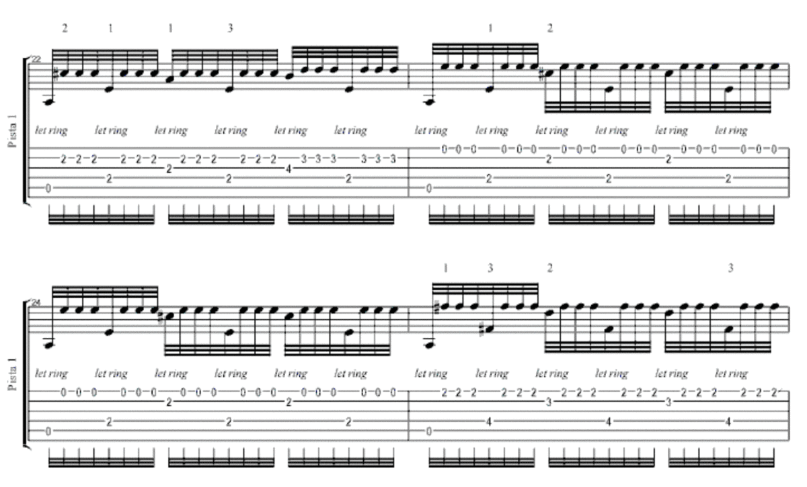
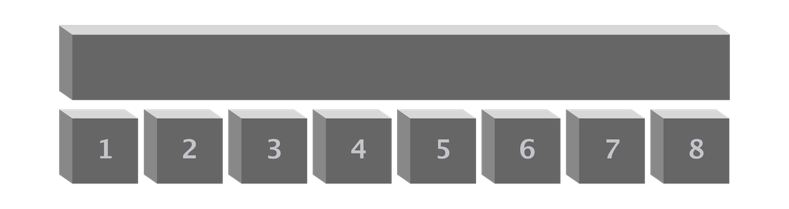
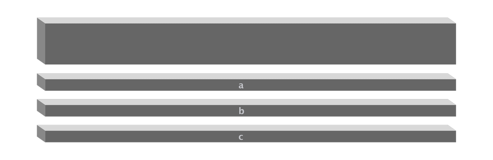

# 拆解

在學習編程的過程中，你會不由自主地學會一個重要技能：

> **拆解**

這麼簡單的兩個字，在人生中的作用重大到不可想像…… 而且它也的確是自學能力中最重要的底層能力之一。

## 橫向拆解

我很幸運，12 歲的時候有機會學習編程（習得了最基本的概念，那時候學的編程語言是 BASIC），所以，相對其他人在 “拆解任務” 方面有更強的初始意識。

後來，15 歲開始學著玩吉他的時候，發現道理其實是一樣的。

有個曲子很難（當然也非常好聽），曲名是 [Recrerdes Da La Alhambra](https://www.youtube.com/watch?v=OOsRMECWKAE) 阿罕布拉宮的回憶。你看看曲譜就知道它多難了：



那怎麼辦？怎麼辦？！—— 我的辦法聽起來看起來都很笨：

> * 每次只彈一個小節；
>   * 而且還是放慢速度彈，剛開始很慢很慢；
>   * 等熟悉了之後逐漸快起來，直到正常速度；
> * 再開始彈下一個小節；
>   * 同樣是放慢速度彈，剛開始很慢很慢；
>   * 等熟悉了之後逐漸快起來，直到正常速度；
> * 再把兩個小節拼起來；
>   * 有些小節拼起來相對容易，另外一些需要掙扎很久才順暢；

如此這般，最終就把這個很難的曲子彈出來了 —— 其實所有的初學者都是這麼乾的。 

可以聽聽這個曲子放鬆一下（當然肯定不是我彈的哈哈）：
```python
from IPython.display import IFrame

IFrame('https://www.youtube.com/embed/OOsRMECWKAE?', width='800', height='450')
```
        <iframe
            width="800"
            height="450"
            src="https://www.youtube.com/embed/OOsRMECWKAE?"
            frameborder="0"
            allowfullscreen
        ></iframe>
        


提起這事，總是會不由自主地嘆口氣 —— 因為在這事上我運氣太差，剛把這個曲子練完沒多久，還沒來得及找人顯擺，就摔斷了掌骨和指骨，給我的手指靈活性造成了不可修複的損傷，於是，後來只能用撥片玩玩吉他了……

話說回來，自學的一個重要技巧就是，

> 把那些很難的任務無限拆分 —— 直至每個子任務都很小，小到都**可操作**為止。

比如，正則表達式，這個你必須學會的東西，學會學好真的不那麼容易。一切的技能都一樣，沒學會之前都是很難很難的，可學會之後用熟了，你就會 “發現” 那東西其實也沒多難……

那剛開始的時候怎麼辦？你其實需要運用拆分的本領：

> * 先囫圇吞棗至少讀一遍教程；
> * 給自己搭好測試的環境（或許在 Regex101.com 上，或許用一個編輯器，比如 VS Code）；
> * 先不管什麼意思，找一些 Regex 自己試試；
> * 正式進入 “精度” 狀態，每一小節每一小節地突破；
> * 搞定一小節之後，就把它與之前的小節再反覆翻兩三遍；
> * 把學習任務拆分成若干塊，再重新逐個突破，比如，匹配，替換，在編輯器中使用，在 Python 代碼中使用；
> * 把各種操作符與特殊字符拆分成若干個組，而後，熟悉到牢記（而不用將來反覆回來查詢）；
> ……

事實上，當你習慣這麼做了之後，就會 “發現” 一切的自學任務，其實都不是 “難”，不過是 “繁雜程度不一” 而已。

很多人最終自學失敗，要麼是不懂拆分任務，要麼就僅僅是**怕麻煩**而已 —— 還是那句話，人活著就挺麻煩的……


## 縱向拆解

拆解的第一種方法是把某個任務拆分成若干個小任務，正如上面的講解那樣，我稱它為 “橫向拆解”。



另外一種方法，我稱它為 “縱向拆解”（有時，我也會用 “分層拆解” 這個說法）。



這種方式在自學複雜的概念體系時特別管用。

編程這種東西，之所以剛開始覺得難學，是因為其中涉及的概念除了之前我們強調的 “[過早引用](Part.1.F.deal-with-forward-references)” 之外，還有個特征：

> 有的概念雖然並不同屬一個層面，卻常常糾纏在一起，沒有明確的提示……

比如，常量、變量、字符串、函數、文件等等的概念，其實並不是某個特定的編程語言的專有概念，它們是所有編程語言都會涉及到的概念，因為計算機處理的就是這些東西，而無論哪個編程語言最終都要通過計算機去處理這些東西。

又比如說，分支與循環，每個編程語言都有對應的語句，所以，分支循環在邏輯判斷、流程管理這個層面，而分支循環的 “**實現**” 應該劃分到另外一個層面中去；而每個語言實現分支循環語句的語法多少有點差異 —— 這些細節屬於那個編程語言本身：
```python
# Python 這麼寫：

for i in range(n):
    ...
```
```javascript
// JavaScript 這麼寫：

var i;
for (i = 0; i < n; i++) { 
  ...;
}
```
自學正則表達式的時候也如此。最基本的規則是屬於 Regex 自己的；而後各種語言的實現各不相同，那是各個編程語言層面的；在各種編輯器中，除了基礎的規則之外，也有它們自己的定製…… 看起來細節很多，但分層分類之後，就會變得很容易理解、很容易記住。

遇到 “面向對象編程” 也是如此。類、實例、對象、繼承、多態…… 這些其實並不屬於某一個編程語言，但它們也確實在幾乎所有編程語言中被實現、被應用 —— 所謂的難，無非是因為屬於兩個層面甚至多個層面的概念被擰在一起教、學、練……

再比如說，在我把這個用編程當作習得自學能力的第一個 “實戰項目” 之時，甚至要把 “讀” 和 “寫” 分成兩個層面，先照顧 “讀”，至於 “寫”，要等到有了基本的 “讀” 的能力之後再說；即便是到了 “寫”，還要劃分至少兩個層面，首先是從 “簡單的函數” 開始，而非上來就要寫個 “大程序”…… 這種拆分層面的技能好像可以用在方方面面呢！

所以，要在自學的過程中，不停地想辦法把它們從層面上區分開來 —— 不能總是把它們混在一塊兒 “大鍋燴”。

日常生活中，我們會遇到被評價為 “理解能力強” 的人，而另外那些不被如此評價的人就很不理解，很迷惑：

> 我到底差在哪兒了，你不說我理解能力強？難道我的理解能力很差嗎？

當老師當久了，經常被這種現象震驚：

> 原來很簡單的東西竟然可能成為很多人一生的障礙。

—— 並且，這話重覆多少遍都不過分。

大多數人不太在意自己腦中的概念之間的關係，因為平日里這也不怎麼耽誤事。但一旦遇到複雜一點的知識體系，就完全搞不定了…… 而所謂知識體系的複雜，無非就是新的概念多一些，概念之間的關聯更複雜一些…… 而概念之間的關聯更複雜一些，無非是各個概念之間不僅只有一種聯繫，最後會形成網狀連接…… 

—— 在《通往財富自由之路》那本書里，我幾乎用了整本書的篇幅去講解、釐清概念及其之間關係的重要性。

複雜嗎？其實並不複雜 —— 在橫向縱向分別逐步分清之後。

可問題在於，腦子裡概念關聯一團糟的人，自己並不覺得，甚至無法知道 —— 他們是那種[跟你一塊去看一場電影卻能看到另外一部電影的人](Part.1.C.must.learn.sth.only.by.reading.md)。說他們理解能力差過分嗎？他們不能理解被評價為理解能力差，難道不是很自然嗎？

分清概念的方法是什麼？其實也不難，就是不斷拆解，不斷主動整理。每次用圖表整理那些概念的時候，就會發現比原來更清晰一些，多次整理，最終就諳熟於心了。

想要再舉更恰當更驚人的例子很難，勉為其難再舉個例子。

當我在 2011 年遇到比特幣的時候，現在回頭看，在當時的情況下，我平日里習慣對概念及其關聯進行各種縱向橫向的拆解這件事給我 “創造” 了巨大的好運。後來我在《[INBlockchain 的開源區塊鏈投資原則](https://github.com/xiaolai/INB-Principles/blob/master/Chinese.md)》里提過這事：

> “比特幣” 這個概念，可以有多重的理解 —— 這也是為什麼人們感到迷惑，或者相互之間很難達成一致理解的根本原因。
> 
> 首先，比特幣是世界上第一個，也是迄今為止最成功的區塊鏈應用。
> 
> 其次，比特幣是一家世界銀行，只不過它不屬於任何權威管轄，它是由一個去中心化網絡構成的。
> 
> 另外，這家叫做比特幣的，去中心化的世界銀行，發行了一個貨幣，恰好也叫 “比特幣”。有些人更喜歡使用相對小心的說法，把這個貨幣指稱為 BTC，而不是 “比特幣”（Bitcoin）。
> 
> 最後，即便在比特幣橫空出世的七年後（2017），也很少有人意識到比特幣（或者 BTC） 其實也可以被理解為這家叫做比特幣的去中心化的世界銀行的股票。

—— 這無非就是把一個概念拆分成若干個層面再對每個層面準確理解而已。

但毫無疑問，這點靠很簡單很簡單的方法練就的理解能力，幫了我大忙。

## 觸類旁通

無論聽起來多麼簡單的任務，落實成代碼肯定沒那麼簡單，沒那麼容易。

以後你會越來越清楚的：寫程序的主要工作量，往往並非來自於在編輯器里敲代碼那個階段。

> 更多的工作量，其實在於如何才能在腦子裡把整個流程拆解清楚，考慮到各個方面…… 

所以，編程，更多是拿著紙筆梳理細節的工作。一旦所有的細節都想明白了，落實成代碼其實是飛快的 —— 越是工程量大的項目越是如此。

這個道理在哪裡都是相同、相通的。不說編程，說寫書，也是一樣的。

隨著時間的推移，你花在 “拆解” 上的時間會越來越多，因為所有大的工程，都可以被拆解成小工程 —— 於是，也為了做出大工程，拆解的工作首先是必須，其次是最耗時費力但最值得的。

我身邊很多人，包括出版社的專業編輯，都慨嘆過我的 “寫書速度”。我猜，實際上把他們驚到甚至驚倒的，並不是他們以為的 “李笑來寫書的速度”，而是 “李笑來打字的速度” 而已。

當我告訴他們我要寫一本什麼書了的時候，實際上，有個工作早就完成了：“系統梳理要寫的那本書的所有細節”，剩下的只是落筆把那些東西寫出來而已 —— 當然，我是敲出來，用我那幾乎無以倫比的輸入速度敲出來 —— 那當然 “顯得” 很快了！

創業也好，投資也罷，還是一樣的。因為我這個人臉皮厚，不怕人們笑話，所以我可以平靜地說這事：

> 我參與過（或投資）**很多**失敗的創業項目……

對所有復盤的結果，無一例外，根源都是當初立項的時候，很多重要細節還沒搞清楚，甚至沒想到要去搞清楚，就已經開始行動…… 於是，在成本不斷積累的情況下，沒完沒了地處理各種 “意外”，沒完沒了地重新制定目標，沒完沒了地拖延，沒完沒了地 “重新啟動”…… 直至開始苟延殘喘，最後不了了之。

拆解得不夠，就容易導致想不清楚，想錯，想歪……

也許，有人可能會理直氣壯地反問，“怎麼可能從一開始就把所有情況都想清楚麽！” 唉，是呀，以前我也是這麼想的…… 直到吃了很多虧，很多很多虧，很多很多很大很大的虧，才 “發現” 且不得不痛下決心去接受：事先想不清楚的，就不要去做。

這是一種特殊、且重要、又極有價值的能力。現實生活中，後來我也見過若干有這種能力的高人，比如，你可以到網上搜一個人名，[莊辰超](https://www.google.com/search?q=莊辰超)，他就是我見過的能做到乾什麼事之前都能全都想清楚的真人活人之一。

自學的時候，拆解任務的重要性更是如此。

這本 “書” 的一個特點，就是把 “自學”（或者平日里稱為 “學習”）這個流程，拆解為 “學”、“練”、“用”、後面還會講到 “造” 總計四個環節來處理 —— 從內容編排本身就這麼乾，甚至，在開頭相當一部分，就明確說明，“根本不指望你讀過一遍就會了”，還反覆提醒，“要重覆讀很多遍，雖然第一遍必須囫圇吞棗”…… 

對於初學者常面臨的尷尬，我們也從一開始就提醒，編程語言，和你之前在學校里學的語文，本質上沒什麼區別，先學會讀，而後在多讀多讀再多讀的同時，開始練習寫 —— 這才真的很自然。

即便是開始講如何寫，我們的做法也是 “從寫函數” 開始，而不是 “來，讓我們寫個程序……” —— 這一點點看起來不起眼的差異，作用是很大的，因為從 “小而完整” 的東西開始做（任何事）非常重要。

[“小” 無所謂，“完整” 才是關鍵](Part.3.F.social-selfteaching.md)。
