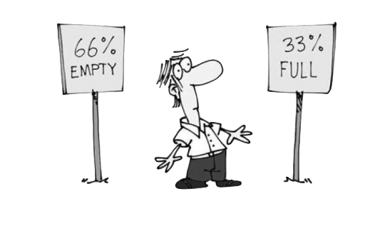

# 剛需幻覺

在前言之中，就舉過一個例子，人們一不小心就把自己搭了進去…… 只不過因為沒搞明白，道理就是道理，跟講道理的老生其實全然沒什麼關係。

在自學中，耽誤人的幻覺很多。比如，時間幻覺。人們總覺得自己時間不夠了，所以學東西的時候總是很急…… 可實際上，練成一門手藝，到夠用的地步，一兩年足夠；到很好的地步，三五年足夠 —— 至於極好麽，那是一輩子的事。結果呢，很多人瞎著急，亂 “省時間”，學啥都不全面，練啥都不足數足量，一晃三五年就過去，然後又開始焦慮，換個手藝再學學再試試…… 然後循環焦慮。

最坑人的幻覺，在我看來，就是剛需幻覺 —— 這又是我杜撰的一個詞…… 聽我慢慢講。

## 感覺總是最大的坑

我的結論是：

> 絕大多數人的自學能力，基本上都是被 “自己的感覺” 耽誤掉的。

即，原本每個人都有一定的自學能力，但最終，都被自己的感覺給幹掉了，直至全然失去自學能力 —— 雖然其後也經常學習，但其後一生從事的全都是學習這個行為里最初級的模式：“模仿”。

為什麼 “模仿” 是學習行為最初級的模式呢？

首先，模仿必須依賴模仿對象，受自己的視野所限。

其次，模仿只能處理表裡如一的簡單知識和技能；一旦遇到那些深層次的、錶面上看不大出來的，模仿就無效了，即便是非要模仿、愣模仿，結果就只能是 “東施效顰”。

在《[把時間當作朋友](https://github.com/xiaolai/time-as-a-friend)》中，我就反覆強調一件事：

> 不要問學它有什麼用，學就是了……

這原本是自學的最佳策略之一，也是自學的最根本策略。然而，聽進去這句話的人不多，即便是我舉了無數的例子，即便是他可能當時也有一點認同…… 然而，轉瞬間又變成了原來的狀態，無論遇到什麼自學機會都不由自主地問：

> 我學它有什麼用啊？

如果，得到的答案中，那 “用處” 對自己不是 “剛需”，瞬間就失去了動力，瞬間就放棄了追求…… 直至某一天，突然 “發現” 那竟然是個剛需…… 於是，臨時抱佛腳。人麽，總是對追求的事情形影相隨；又有誰會對曾經放棄的事情念念不忘呢？於是，下一次還是會再做 “預算不足” 的決定。

最終失去自學能力的人，都是因為對 “剛需” 的判斷失誤 —— 這就是我說的 “剛需幻覺”。

## 剛需幻覺

“剛需幻覺” 的根源在於：

> 你不會的東西，對你來說感覺上就不是剛需。

要不是這本 “書” 里有個自學編程那麼大且立體的一個例子存在，供我反覆地、多角度地闡述道理，上面這句話還真的不好解釋 —— 即便解釋清楚了，也因為缺乏生動的例證而失去效力。

正則表達式（Regex）就是很好的例子。

當你沒有學會它的時候，甚至不知道它的時候，感覺上，你不可能覺得那是個剛需 —— 因為你一直都活得好好的，甚至在你全然不知道那個東西竟然存在的情況下。

你略微學了一下，沒學會、沒學好、或者乾脆放棄了之後，在感覺上，你也同樣不會覺得那是剛需。因為你不會用它，所以你當然 “用不上它”…… 你根本沒辦法知道你不懂正則表達式這個事實讓你 “未得到” 什麼（不是 “失去”，因為你不曾擁有）。

然而，只要你花了一點力氣，真的掌握了它，你會有兩個 “發現”：

> * 你根本離不開它<a href='#fn1' name='fn1b'><sup>[1]</sup></a>；
> * 它其實真沒多難……

第二個 “發現” 總是讓你無比慶幸 —— 幸虧學了，幸虧 “發現” 了，否則，自己耽誤自己一輩子且完全不自知。慶幸！慶幸！！但第一個 “發現” 更為重要，因為但凡哪怕只有過一次這樣的經歷，你就可以永久擺脫 “剛需幻覺” 的詛咒。

編程也是一樣的，當你開始學編程的時候，被身邊的人發現，他們中的大多數一定會問你：

> 你學它要幹嘛啊？

無論你怎麼回答，他們的反應應該都是差不多的：反正就是不理解你的投入是否合理。

然後，等你學會了編程，掌握了這個技能，你的 “發現” 肯定包括那兩點：

> * 你根本離不開它；
> * 它其實真沒多難……

哪怕很簡單的技能都是如此。許多年前，我專門花一兩周的時間練習鍵盤盲打，以及把輸入法方案選擇改為微軟雙拼方案…… 也有人揶揄過我：“我靠，你練這玩意幹嘛？難道將來要當一輩子打字員？”

當然，我很早就練就了一定的自學能力，所以很早就有一些自學經驗，所以我用不著事後 “發現”，而是 “直接就知道”，將來：

> * 我根本離不開它；
> * 它其實真沒多難……

事實上呢？事實上就是如此。打字速度極快，直接導致了後來我成為多產作家。無法想象如果我是個打字速度極慢的人，我如何寫書，如何寫那麼多書和那麼多文章；以及，後來我又是如何於 2018 年 9 月的某一天開始在 72 小時之內完成《韭菜的自我修養》初稿…… 可問題在於，這個技能難嗎？在我長大的年代里，它算個技能；在今天，全都是從小就用鍵盤的人的世界里，誰不會呢？

所以，當面對一項新技能的時候，“覺得並非剛需” 肯定是幻覺。因為一個技能到底是不是剛需，在掌握它之前是不知道的……

> 只有真正掌握了那個技能之後，那個技能才會 “變” 成剛需。

並且，

> 一旦掌握了某項技能，它只能是剛需。

這種幻覺非常坑人。

我們的大腦，有一種神奇的功能 —— “無論如何都會用已有信息拼成一個完整圖像的功能”。

“無論如何” 的意思是說，不管那已有信息有多麼凌亂、有多麼殘缺、有多麼無意義、人腦竟然還是可以拼出一個完整的 “有意義” 的圖像。

這一點也經常被人利用。在新聞學里，就有著名的 “Framing Effect”：


這個原理也經常被各路營銷使用：



很容易想象，經常被這些東西誤導的人，“腦力” 欠缺到什麼程度 —— 這當然也是他們全無自學能力的結果之一。

而當我們被剛需幻覺所左右的時候，我們明顯是使用 “片面的信息” 拼出了 “完整的意義”，而後被其誤導，嚴重誤導，且全然不自知 —— 最氣人的是，誤導我們的竟然不是別人，竟然是我們自己的大腦！剛需幻覺如此，時間幻覺、困難幻覺亦如是。後面會講到的註意力漂移，也依然是這種情況，自己才是真正的元凶……

所以，在決定學任何東西的時候，最好不要去咨詢身邊的人 —— 除非你確定對方是高手，最好是自學高手。否則，你遇到的永遠是懷疑、打擊、甚至嘲笑。最令人遺憾、最令人無奈的是，那些人其實也不是壞人，他們其實也不是故意，他們只是被自己的 “剛需幻覺” 誤導了而已，他們（竟然）以為所有人都和他們一樣…… 然後，若是你（居然）聽信了他們的話，那就實在是太慘了！

**要學，想學，那就自顧自去學吧，用不著征求別人的意見！**

## 優勢策略

如何不被 “剛需幻覺” 所迷惑、所限制呢？

首先，基礎策略是，要深刻理解這個現象及其解釋：

> 對任何一項技能來說，**剛需是自學的結果**，而不是自學的原因。

用 “是否為剛需” 作為自己是否開始學習的理由，註定會吃虧的，因為如此做的下場就是肯定被 “剛需幻覺” 所迷惑、所限制。

而後，也是更為重要的一個策略：

> **做個自驅動的人**，而非被外部驅動的被動的人。

這基本上是個越早建立越好的習慣。絕大多數人一生都是被動者，終生只是被外界驅動而已。所以，他們會在某一時刻，“發現” 某個技能是剛需，然後再去學，但可惜卻肯定的是，到那時候預算總是並不充裕，總是捉襟見肘。

最後一個很簡單卻很有效的策略是三個字，[之前提到過的](Part.2.E.deliberate-thinking.md)：

> **找活乾**

有活乾，真的很幸福。

## 影響下一代

想象一下有些父母是這樣跟孩子對話的：

> * 爸爸（媽媽），你在乾什麼呀？
> * 我在學 \_\_\_\_\_\_\_\_\_\_\_\_\_\_\_\_\_（請自行填空）
> * 那你學它乾什麼用啊？
> * 等我學會就知道了…… 

而後又過了段時間……

> * 孩子，過來看看！這是爸爸（媽媽）做的東西！

我猜，這樣的孩子，會從小就自然而然地破解掉 “剛需幻覺”。

所謂的 “潛移默化”，所謂的 “耳聞目染”，其實是很簡單的東西。

然而，效果呢？效果不會因為策略的簡單或者容易而消減。通常的情況是，越是簡單容易的策略，效用越是驚人。

所以，正確結論是這樣的：

> **一切的技能都是剛需。**

雖然，這並不意味著你不需要選擇。

然而，至於學還是不學，其實從來都不是從 “有沒有用” 來判斷的，真正有意義的判斷依據只有一條：

> 有沒有時間？

有時間就學唄！沒時間就擠時間唄！學得不足夠好怎麼辦？花更多時間唄……

-----
**腳註**

<a name='fn1'>[1]</a>：寫這本書的時候，前後弄出來那麼多 `.ipynb` 文件 —— 於是，到最後哪怕 “生成個目錄” 這樣看起來簡單的活，若是會用正則表達式，就能幾分鐘完成；但若是不會，那就得逐一手工提取、排序、編輯…… 對我來說怎麼可能不是**剛需**！
```python
import re
import os

files = [f for f in os.listdir('.') if os.path.isfile(f)]
files.sort()
for f in files:
    if '.ipynb' in f:
        with open(f, 'r') as file:
            str = file.read()
            pttn = r'"# (.*)"\n'
            r = re.findall(pttn, str)
            if len(r) > 0:
                print(f'> - [{f.replace(".ipynb", "")}（**{r[0]}**）]({f})') # 生成 markdown
```
    > - [01.preface（**前言**）](01.preface.md)
    > - [02.proof-of-work（**如何證明你真的讀過這本書？**）](02.proof-of-work.md)
    > - [Part.1.A.better.teachyourself（**為什麼一定要掌握自學能力？**）](Part.1.A.better.teachyourself.md)
    > - [Part.1.B.why.start.from.learning.coding（**為什麼把編程當作自學的入口？**）](Part.1.B.why.start.from.learning.coding.md)
    > - [Part.1.C.must.learn.sth.only.by.reading（**只靠閱讀習得新技能**）](Part.1.C.must.learn.sth.only.by.reading.md)
    > - [Part.1.D.preparation.for.reading（**開始閱讀前的一些準備**）](Part.1.D.preparation.for.reading.md)
    > - [Part.1.E.1.entrance（**入口**）](Part.1.E.1.entrance.md)
    > - [Part.1.E.2.values-and-their-operators（**值及其相應的運算**）](Part.1.E.2.values-and-their-operators.md)
    > - [Part.1.E.3.controlflow（**流程控制**）](Part.1.E.3.controlflow.md)
    > - [Part.1.E.4.functions（**函數**）](Part.1.E.4.functions.md)
    > - [Part.1.E.5.strings（**字符串**）](Part.1.E.5.strings.md)
    > - [Part.1.E.6.containers（**數據容器**）](Part.1.E.6.containers.md)
    > - [Part.1.E.7.files（**文件**）](Part.1.E.7.files.md)
    > - [Part.1.F.deal-with-forward-references（**如何從容應對含有過多 “過早引用” 的知識？**）](Part.1.F.deal-with-forward-references.md)
    > - [Part.1.G.The-Python-Tutorial-local（**官方教程：The Python Tutorial**）](Part.1.G.The-Python-Tutorial-local.md)
    > - [Part.2.A.clumsy-and-patience（**笨拙與耐心**）](Part.2.A.clumsy-and-patience.md)
    > - [Part.2.B.deliberate-practicing（**刻意練習**）](Part.2.B.deliberate-practicing.md)
    > - [Part.2.C.why-start-from-writing-functions（**為什麼從函數開始？**）](Part.2.C.why-start-from-writing-functions.md)
    > - [Part.2.D.1-args（**關於參數（上）**）](Part.2.D.1-args.md)
    > - [Part.2.D.2-aargs（**關於參數（下）**）](Part.2.D.2-aargs.md)
    > - [Part.2.D.3-lambda（**化名與匿名**）](Part.2.D.3-lambda.md)
    > - [Part.2.D.4-recursion（**遞歸函數**）](Part.2.D.4-recursion.md)
    > - [Part.2.D.5-docstrings（**函數的文檔**）](Part.2.D.5-docstrings.md)
    > - [Part.2.D.6-modules（**保存到文件的函數**）](Part.2.D.6-modules.md)
    > - [Part.2.D.7-tdd（**測試驅動的開發**）](Part.2.D.7-tdd.md)
    > - [Part.2.D.8-main（**可執行的 Python 文件**）](Part.2.D.8-main.md)
    > - [Part.2.E.deliberate-thinking（**刻意思考**）](Part.2.E.deliberate-thinking.md)
    > - [Part.3.A.conquering-difficulties（**戰勝難點**）](Part.3.A.conquering-difficulties.md)
    > - [Part.3.B.1.classes-1（**類 —— 面向對象編程**）](Part.3.B.1.classes-1.md)
    > - [Part.3.B.2.classes-2（**類 —— Python 的實現**）](Part.3.B.2.classes-2.md)
    > - [Part.3.B.3.decorator-iterator-generator（**函數工具**）](Part.3.B.3.decorator-iterator-generator.md)
    > - [Part.3.B.4.regex（**正則表達式**）](Part.3.B.4.regex.md)
    > - [Part.3.B.5.bnf-ebnf-pebnf（**BNF 以及 EBNF**）](Part.3.B.5.bnf-ebnf-pebnf.md)
    > - [Part.3.C.breaking-good-and-bad（**拆解**）](Part.3.C.breaking-good-and-bad.md)
    > - [Part.3.D.indispensable-illusion（**剛需幻覺**）](Part.3.D.indispensable-illusion.md)
    > - [Part.3.E.to-be-thorough（**全面 —— 自學的境界**）](Part.3.E.to-be-thorough.md)
    > - [Part.3.F.social-selfteaching（**自學者的社交**）](Part.3.F.social-selfteaching.md)
    > - [Part.3.G.the-golden-age-and-google（**這是自學者的黃金時代**）](Part.3.G.the-golden-age-and-google.md)
    > - [Part.3.H.prevent-focus-drifting（**避免註意力漂移**）](Part.3.H.prevent-focus-drifting.md)
    > - [Q.good-communiation（**如何成為優秀溝通者**）](Q.good-communiation.md)
    > - [R.finale（**自學者的終點**）](R.finale.md)
    > - [S.whats-next（**下一步乾什麼？**）](S.whats-next.md)
    > - [T-appendix.editor.vscode（**Visual Studio Code 的安裝與配置**）](T-appendix.editor.vscode.md)
    > - [T-appendix.git-introduction（**Git 簡介**）](T-appendix.git-introduction.md)
    > - [T-appendix.jupyter-installation-and-setup（**Jupyterlab 的安裝與配置**）](T-appendix.jupyter-installation-and-setup.md)
    > - [T-appendix.symbols（**這些符號都代表什麼？**）](T-appendix.symbols.md)


<a href='#fn1b'><small>↑Back to Content↑</small></a>
