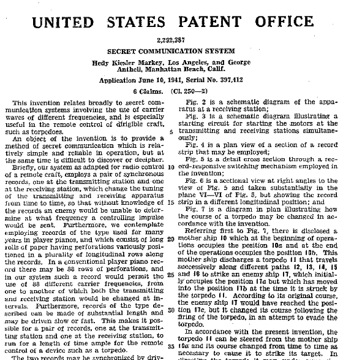

# 自學者的社交

很多人有莫名其妙的誤解，以為 “自學”（self-teaching）就一定是 “自己獨自學”（solo-learning），殊不知，自學也需要社交。也有另外一些人，因為 “專心” 到一定程度，覺得社交很累，所以開始抵觸一切社交。這些都不是全面的看法。

事實上，在任何領域，社交都是必須的，只不過，很多人沒有建立、打磨過自己的社交原則，所以才被各種無效社交所累。就算討厭，討厭的也不應該是社交，而是無效社交。

在自學的任何一個階段，學、練、用、造，社交都可能存在。

哪怕是在最枯燥，看起來最不需要社交的 “練” 的階段，社交也會起很大的作用 —— 在自己累了的時候，看到有人還在練，看到很多人都在練，看到很多人其實也挺累的但還在練…… 這些都是讓自己感覺沒那麼費勁的好辦法。

實際上，在最初 “學” 的階段，社交也是極為重要的。

生活中，你遇到過這樣的現象沒有：“看見別人打針，自己先疼得受不了……” 這是因為我們的大腦中有一種神經元，叫做**鏡像神經元**（Mirror Neuron），它會讓我們 “感同身受”，當我們看到另外一個人正在做什麼的時候，鏡像神經元會儘力給我們足夠的刺激，讓我們 “體驗” 那個人的感受。以前人們不知道為什麼哈欠竟然會 “傳染”，現在科學家們很清楚了 —— 那就是鏡像神經元在起作用。

鏡像神經元的存在，使得我們有模仿能力、有通感能力、有同情心、有同理心…… 這也是為什麼人類天然有社交需求的重要原因，因為我們的大腦皮層上都有很多的鏡像神經元。

一般來說，物品、書籍之類非人的東西，都不大可能激活鏡像神經元。只有看到人的時候，鏡像神經元才會被激發。所以，你送給小朋友一把吉他，他不會有什麼興趣的。可若是你在彈琴的時候被他看見，他的鏡像神經元就會因為你的行為而被觸發，進而對彈奏吉他感興趣 —— 註意，不是對吉他本身感興趣。若是你在彈琴的時候，帶著某種能夠打動他的情緒，那他更容易被影響，因為情緒更能激發鏡像神經元。也就是說，一切的學習起初都基於模仿，一切的模仿，都源自於看到真人的行為 —— 哪怕是在電影里看到，雖然只不過是影像而已，並非真人，但畢竟是真人的影像。

所以，無論學什麼技能，都要找到用那種技能的人，這樣我們的鏡像神經元才可能更容易被激發，學習效果才會好。若是能找到熱愛那項技能，乃至於一使用那項技能就很開心（最好的情緒之一）的人，那就更好了。激情這東西，是少數幸運兒才長期持有的東西，大多數人小時候挺多，過了十五六歲之後就開始有意無意磨滅了激情，且並不自知。

之前提到，

> 當我們看到另外一個人正在做什麼的時候，鏡像神經元會**儘力**給我們足夠的刺激，讓我們 “體驗” 那個人的感受。

這句話里有個詞很重要，“儘力”。因為鏡像神經元只能調用我們大腦里已有的信息去模擬對方的感受，所以，它最多也就是 “儘力”，無法做到 “確保正確”。今天的糖尿病患者使用的皮下註射針頭，已經可以做到很細，細到讓使用者 “無感” 的地步，所以，當一個糖尿病患者給自己註射胰島素的時候，他自己並不覺得疼，可是看的人卻能 “疼” 到緊皺眉頭的地步，為什麼？因為旁觀者的大腦里沒有實際用那麼細的針頭註射胰島素的經驗，所以鏡像神經元在旁觀者 “感同身受” 時所調用的，其實是過往旁觀者自己打針的體驗 —— 被很粗的針頭做靜脈註射的痛苦體驗。

所以，很多人誤以為他們眼裡的成功者靠的是 “堅持”、靠的是 “毅力”，這完全是自己的鏡像神經元 “儘力” 的結果，是 “調用自己過往經驗去**感同身受**的結果”…… 事實上呢？那些 “成功者” 其實並不在意成功，因為到死之前成長不應該也不可能結束，因為那是他們的生活方式，學習、進步、探索、迂迴，甚至折騰、挫敗和迷茫，都是他們生活中必不可少的內容，這是最初不自覺的選擇，談不上什麼 “堅持”，談不上什麼 “毅力”…… 說實話，對他們來說，不讓折騰才真痛苦呢，不學習才需要堅持和毅力呢！

再進一步，這也是為什麼要選擇朋友的原因。人與人之間有很大的差異，最大的差異來自於性格養成，大多數人會淪為表現型人格，只有少數人才會在不斷調整中保持、呵護、進一步培養 “進取型” 人格。他們自然而然地更為樂觀，更有耐心，更有承受力，更有戰鬥力，更能生產更能體驗學習與進步的樂趣。與這樣的人在一起，學習會更容易 —— 只因為鏡像神經元會更容易地被正確激發。說清楚了，道理其實挺簡單的。

有一次朋友跟我聊起他苦於沒辦法培養自己孩子的正經興趣愛好…… 我說，其實很簡單，只不過是你方法錯了。你不用告訴孩子 “應該學什麼，應該對什麼感興趣”，而是，想盡一切辦法讓孩子見識到擁有那個技能的，令他產生**羡慕情緒**的人 —— 只要孩子羡慕那個人，他就自然而然地有 “我也想這樣” 的想法，到最後，誰都攔不住。這就是鏡像神經元的力量。進而，所謂的社交，還真不一定是非要跟人說話、聊天…… 見識到，也是社交的最主要組成部分。

你看，誰說社交不重要？

進而，想要把一門手藝搞到真正 “精湛” 的地步，最有效的方法就是儘早進入 “造” 的階段 —— 所謂的 “造”，就是不斷**創造**的 “造”。

自學這門手藝，很簡單，就是不斷地學：
```python
def teach_yourself(anything):
    while not create():
        learn()
        practice()
    return teach_yourself(another)

teach_yourself(coding)
```
學上幾個，自然就很精湛。而其它的用自學這門手藝習得的手藝，基本上都可以用 “是否做出了像樣的作品” 作為檢驗自己的那門手藝是否達到了精湛的衡量指標。


硅谷有一家著名的孵化器，叫 Y-Combinator，現在的掌門人是個很年輕的人，Samuel H. Altman。他在那篇著名的文章《[Advice for ambitious 19 year olds](https://blog.samaltman.com/advice-for-ambitious-19-year-olds)》中有一個精彩的建議：

> No matter what you choose, build stuff and be around smart people. <br />
> 無論你選擇了什麼，都要造出東西來，要與聰明人打交道。

當然，對於 “聰明人” 這個概念，我和 Sam 的看法並不一致。在我看來，有好作品的人都很聰明，但還是那句話，那不是天分和智商，那分明是有效積累。

我個人最看重的個人品質之一，就是**有沒有像樣的作品**。

很少有人有像樣的作品。人群中只有少數人最終能拿出完整的作品——人與人之間的差異是如此之大，乃至於少數人有作品，更少數人有好的作品，只極少數極少數人才可能做出傳世的作品；而與此同時，絕大多數人（萬分之九千九百九十九的人）一輩子都沒有像樣的作品，他們連一篇作文都寫不明白。於是，與有像樣作品的人打交道，總是非常值得。

並且，跟他們打交道也不費勁，都是思考非常通透的人，通常溝通能力極強。哪怕溝通起來貌似費勁的那一小部分，事實上也不是難以溝通，那隻不過是人家簡單朴實而已。

我甚至經常建議我的合伙人們，在招人的時候，把這一點當作最靠譜的判斷方式。少廢話，少吹牛逼，給我看看你的作品。這個原則可以一下子過濾掉所有的不合格者。另外一個很自然的現象是，如果一個人能做出像樣的東西來，那麼他身邊的聰明人密度無論如何都會比其他人的高出很多。

地球上有效社交密度最高的地方，是 [Github](https://github.com)。有些程序員們常開玩笑，說 Github 是全球最大的同性社交網站，事實上，他們不知道，女性程序員的比例正在逐步提高，而且女性在科學上，從來就沒有屈居二線過<a href='#fn1' name='fn1b'><sup>[1]</sup></a>。

在 Github 上，找到自己感興趣的項目，而後為那項目貢獻一己之力，用自己的工作贏得社區的認同…… 這就是 Github 上的社交方式。若是自己做了有意義的項目，就會有更多人關註；若是那項目對很多人有用，那就不僅有很多人關註，更有很多人會像當初的你一樣為這個項目做貢獻…… 這就是程序員們的**有效社交**。

Github 能成為地球上最大的有效社交網絡，沒毛病，因為**用作品社交肯定是最高效的。**

所以，無論學什麼，都要想盡一切辦法儘快做出自己的作品。做一個產品出來的過程中，會磨練另外一項自學者不可或缺的能力和素質：

> **完整**

與之前提到的另外一項加起來，就構成了自學者的最基本素養：

> * 學就學得**全面**；
> * 做就做得**完整**。


無論多小的作品，都會讓創作者感受到 “單一技能的必然無效性” —— 你試試就知道了。哪怕你想做個靜態網站，你都會發現，僅僅學會 html/css 是不夠的，因為部署到遠端服務器上的時候，你無論如何都得學學 Linux 基本操作…… 而已然具備了自學者基本素養的你，自然會想辦法 “全面掌握”，而不是糊弄一下而已。

更為重要的是，一旦你開始創作作品，你更大的 “發現” 就是，你肯定需要很多 “之前看起來並不相干的知識與技能”，而非 “只靠專業就夠了”……

還是拿我出第一本書為例。那之前我沒有寫過書，若是出版了書放在書店，沒有人知道李笑來是誰…… 於是，只有內容本身，並不保證那書能賣出去。除了把內容寫出來之外，我必然要去學習很多之前完全沒碰過的東西，比如 “如何才能做到系統持續地修訂內容”；又比如，“如何與出版社編輯正常溝通”；再比如，“如何取一個好書名”…… 一個賽一個地 “與專業無關”。

所以，“做得完整”，從來都不是容易的事情。

從這個角度去理解，你就會明白那些高明的手藝人為什麼總是做小東西 —— 那是因為在追求完整的過程中，你必然會發現，越小越容易完整。這也是為什麼庸人總是好高騖遠，因為他們不顧完整，所以就可以妄圖建造海市蜃樓。

手藝人不怕做的事小。而且，“小” 無所謂，“完整” 才是關鍵。

有作品和沒作品的人理解能力也不一樣。做過作品的人，看到類似 MoSCoW Method 的做事原則，瞬間就能有所感悟，而沒有作品的人，卻不見得有一樣的感受。

> 順帶給你看個 Wikipedia 上的鏈接列表，在編程領域里，有無數可以借鑒到生活中的哲學、方法論：
> - [If it ain't broke, don't fix it](https://en.wikipedia.org/wiki/If_it_ain%27t_broke,_don%27t_fix_it)
> - [KISS principle](https://en.wikipedia.org/wiki/KISS_principle)
> - [Don't repeat yourself](https://en.wikipedia.org/wiki/Don%27t_repeat_yourself)
> - [Feature creep](https://en.wikipedia.org/wiki/Feature_creep)
> - [List of software development philosophies](https://en.wikipedia.org/wiki/List_of_software_development_philosophies)
> - [Minimum viable product](https://en.wikipedia.org/wiki/Minimum_viable_product)
> - [MoSCoW method](https://en.wikipedia.org/wiki/MoSCoW_method)
> - [Overengineering](https://en.wikipedia.org/wiki/Overengineering)
> - [Worse is better](https://en.wikipedia.org/wiki/Worse_is_better)
> - [S.O.L.I.D.](https://en.wikipedia.org/wiki/SOLID)
> - [Unix philosophy](https://en.wikipedia.org/wiki/Unix_philosophy)

給自己足夠長的時間去學；在充足 “預算” 之下耐心地練；不斷找活乾，以用代練；然後，最重要的是，一定要儘快嘗試著做出屬於自己的**完整**作品，無論大小。

只有這樣，你才是個值得被交往的人。

-----
**腳註**

<a name='fn1'>[1]</a>：NPR：[Most Beautiful Woman' By Day, Inventor By Night](https://www.npr.org/2011/11/27/142664182/most-beautiful-woman-by-day-inventor-by-night)



上圖是保存在美國專利局的一個存檔文件（US Patent 2,292,387, Aug 11, 1942）截圖。這項專利的發明者是 [Hedy Lamarr](https://en.wikipedia.org/wiki/Hedy_Lamarr)，人家長得是這樣的：


Hedy Lamarr 是好萊塢最知名的演員之一，並且，她也是自學高手：

> Although Lamarr had no formal training and was primarily self-taught, she worked in her spare time on various hobbies and inventions, which included an improved traffic stoplight and a tablet that would dissolve in water to create a carbonated drink. The beverage was unsuccessful; Lamarr herself said it tasted like Alka-Seltzer.

<a href='#fn1b'><small>↑Back to Content↑</small></a>
