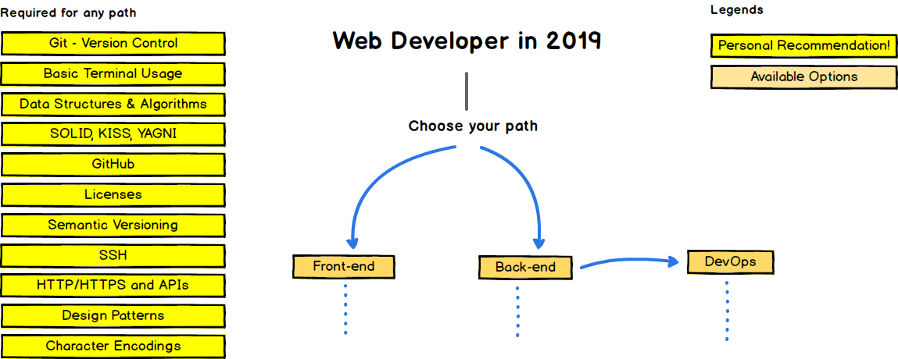
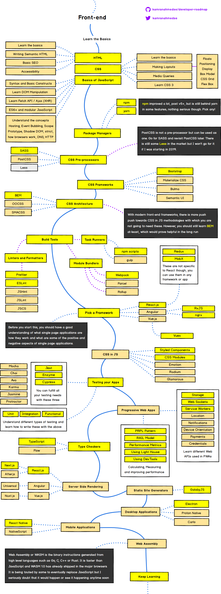
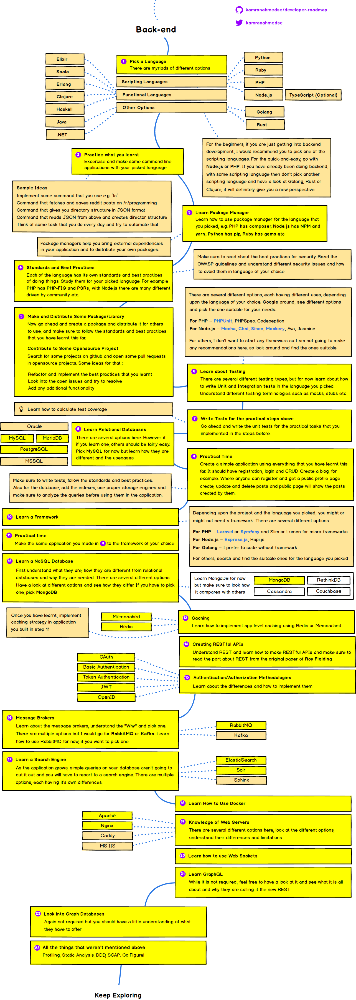
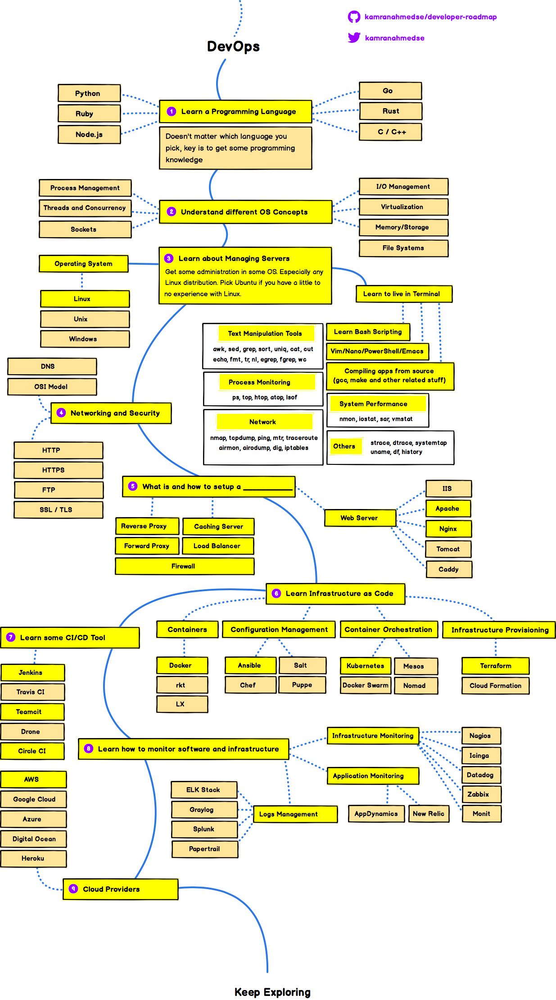

# 下一步乾什麼？

理論上，下一步你的選擇很多。自學是門手藝，你可以用它去學任何你想要掌握的其它手藝。如果，你有意在編程這個領域繼續深入，那麼，以下就是一些不錯的線索。

當然，最先應當做的是，去檢查一下自己的 “突擊” 的結果，去 Pythonbasics.org 做做練習：

> https://pythonbasics.org/Exercises/

除了我在這裡介紹的之外，請移步 The Hitchhiker's Guide to Python，它更為全面：

> https://docs.python-guide.org/

## Python 必讀書籍

無論學什麼，一本書肯定不夠，以下是學習 Python 的基本必讀書籍：

> * [The Python Tutorial](https://docs.python.org/3/tutorial/)
> * [The Hitchhiker’s Guide to Python!](https://docs.python-guide.org/)
> * [Think Python: How to think like a computer scientist](http://greenteapress.com/wp/think-python-2e/)
> * [Automate the Boring Stuff with Python](https://automatetheboringstuff.com)
> * [Effective Python](https://effectivepython.com)
> * [Python Cookbook](https://www.amazon.com/Python-Cookbook-Recipes-Mastering-ebook/dp/B00DQV4GGY)
> * [Fluent Python](https://www.amazon.com/Fluent-Python-Concise-Effective-Programming-ebook/dp/B0131L3PW4)
> * [Problem Solving with Algorithms and Data Structures using Python](http://interactivepython.org/runestone/static/pythonds/index.html)
> * [Mastering Object-oriented Python - Transform Your Approach to Python Programming](https://www.amazon.com/dp/B00JVQ14UO/ref=dp-kindle-redirect?_encoding=UTF8&btkr=1)

更多 Python 書籍：

> https://pythonbooks.revolunet.com

千萬別覺得多，只要真的全面掌握，後面再學別的，速度上都會因此快出很多很多……

## Python Cheatsheet

你已經知道了，這種東西，肯定是自己整理的才對自己真的很有用…… 不過，你也可以把別人整理的東西當作 “用來檢查自己是否有所遺漏” 的工具。

網上有無數 Python Cheatsheets，以下是 3 個我個人認為相當不錯的：

> * [Comprehensive Python Cheatsheet](https://gto76.github.io/python-cheatsheet/)
> * [Python Crash Course - Cheat Sheets](https://github.com/ehmatthes/pcc/tree/master/cheat_sheets)
> * [Pysheeet](https://www.pythonsheets.com/)

## Awesome Python

Github 上的 “居民” 現在已經養成了一個慣例，無論什麼好東西，他們都會為其只做一個 “Awesome ...” 的頁面，在裡面齊心協力搜集相關資源。比如，你想學 Golang，那你去 Google 搜索 [`Awesome Go`](https://www.google.com/search?q=awesome+go)，一定會給你指向到一個 Github 上的 “Awesome Go” 的頁面…… 

以下是 Awesome Python 的鏈接：

> https://github.com/vinta/awesome-python

## CS 專業的人都在學什麼？

如果你真有興趣把這門手藝學精，不妨看看 Computer Science 專業的人都在學什麼…… 

下麵這個鏈接值得認真閱讀：

> http://matt.might.net/articles/what-cs-majors-should-know/

## 全棧工程師路徑圖

既然學了，就肯定不止 Python —— 在扎實的基礎之上，學得越多學得越快。以下是一個 “全棧工程師路徑圖”，作者是位迪拜的帥哥 [Kamran Ahmed](https://github.com/kamranahmedse)：

> https://github.com/kamranahmedse/developer-roadmap
>
> Below you find a set of charts demonstrating the paths that you can take and the technologies that you would want to adopt in order to become a frontend, backend or a devops. I made these charts for an old professor of mine who wanted something to share with his college students to give them a perspective; sharing them here to help the community.
> 
> Check out my blog and say "hi" on Twitter.
> 
> **Disclaimer**
>
> The purpose of these roadmaps is to give you an idea about the landscape and to guide you if you are confused about what to learn next and not to encourage you to pick what is hip and trendy. You should grow some understanding of why one tool would better suited for some cases than the other and remember hip and trendy never means best suited for the job

## Introduction

## Frontend Roadmap

## Back-end Roadmap

## DevOps Roadmap

路漫漫其修遠兮…… 

但多有意思啊？這完全就是一場闖關游戲。
