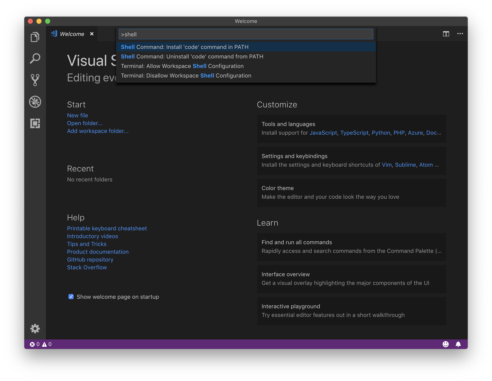
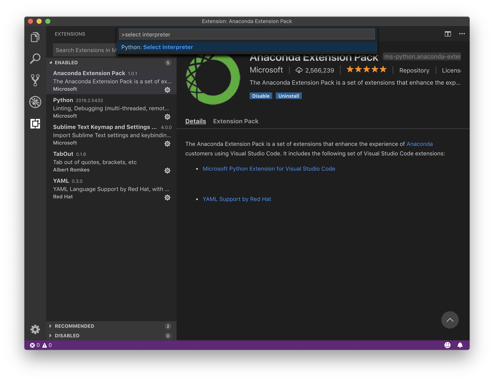
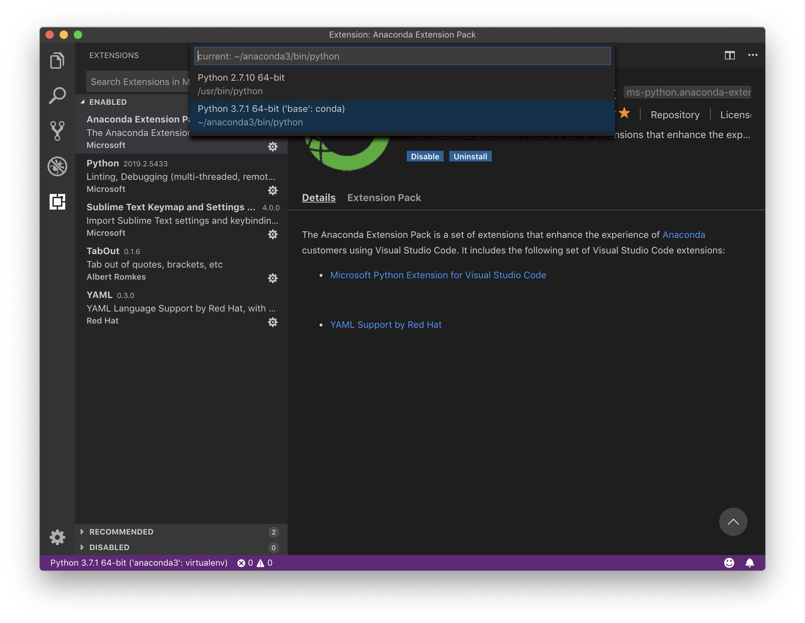
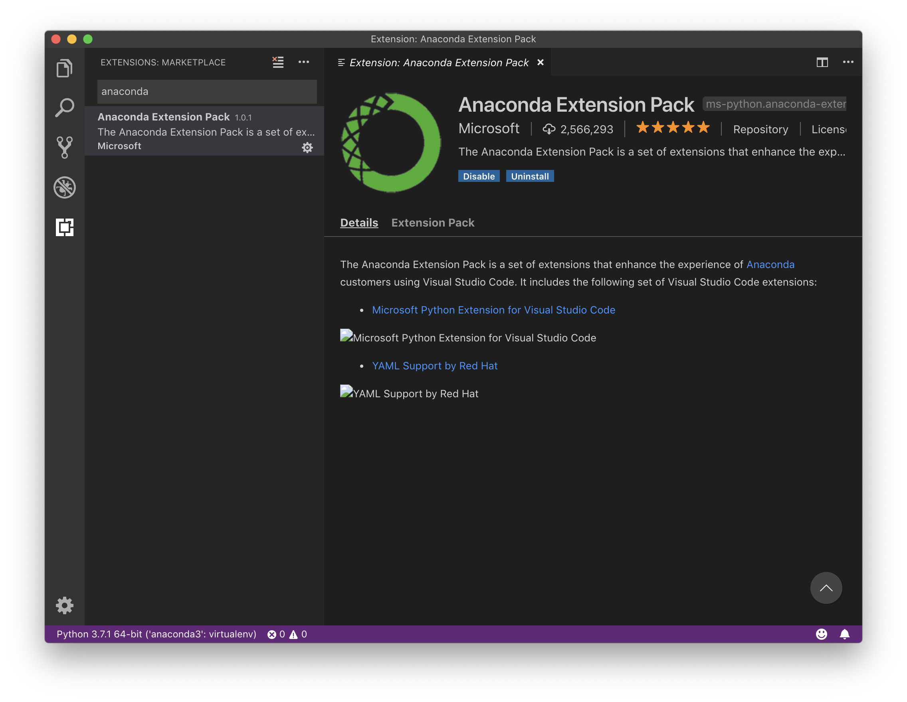
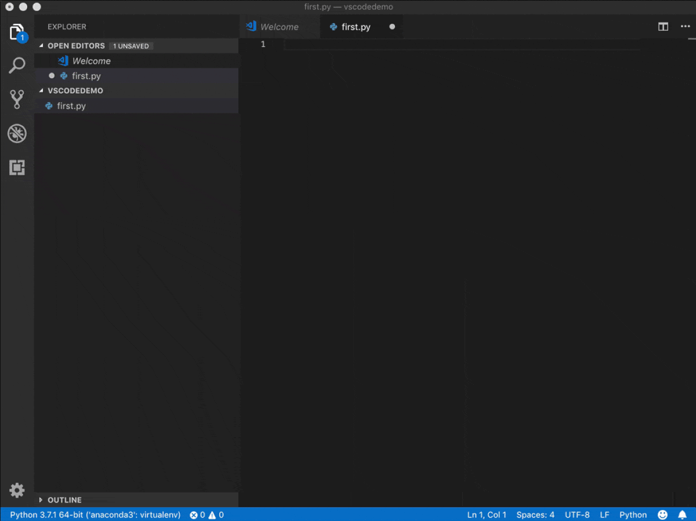

# Visual Studio Code 的安裝與配置

官方文檔請查詢：

> https://code.visualstudio.com/docs

## 允許命令行啟動 VS Code

使用快捷鍵 `⇧⌘p` 呼出 Command Palette，在其中輸入 `shell command`，而後選中 `Install 'code' command in PATH`。此後，就可以在 Terminal 命令行中使用 `code` 命令了。(Windows 系統安裝 VS Code 時會自動配置好，並不需要此步驟)



## 選擇 Python 解析器版本

使用快捷鍵 `⇧⌘p` 呼出 Command Palette，在其中輸入 `select interpreter`，而後選中 `Python: Select Interpreter`。



而後，在系統中已安裝的若干個版本中選擇你需要的那一個。MacOS 系統自帶一個 Python 2.7，而我們安裝的 Anaconda 為系統另外安裝了一個 Python 3.7。



## 安裝擴展

使用快捷鍵 `⇧⌘x` 呼出擴展面板。安裝 anaconda 擴展，它會連帶裝上 python 擴展：



另外，為了輸入方便，有兩個擴展可選安裝：

> * Tabout 有它之後，可以使用 TAB 鍵跳出光標後的括號、引號等等；
> * Sublime Text Keymap and Settings Importer 有它之後，可以在 VS Code 中使用 SublimeText 的快捷鍵，最重要的當屬多光標編輯 `⇧⌘l`……

## 自動補全

專業編輯器最重要的功能之一，就是能夠在你輸入的時候它幫你做到 “自動補全”，通常使用的快捷鍵是 TAB 鍵 `⇥`。

TAB 鍵 `⇥` 觸發的自動補全有兩種：

> * 當前文件中已有的字符串。比如，之前你輸入過 `sum_of_word`；那麼，之後，你就可以輸入 `su` 或者乾脆 `sow` 而後按 TAB 鍵 `⇥`，“自動補全” 功能會幫你完成輸入 `sum_of_word`
> * 已有的 Snippets。比如，當你需要輸入 `if ...: ...` 的時候，實際上當你輸入 `if` 或者甚至 `i` 之後，你就可以用 TAB 鍵 `⇥`，“自動補全” 功能會為你 “自動完成” 語句塊的輸入。

字符串自動補全，使用的是所謂的 Fuzzy Match。輸入 `sum_of_word` 中所包含的任意字符的任意組合（按順序），它都會儘量去匹配；所以，`su` 和 `sow` 都可以匹配 `sum_of_word`，再比如，`rst` 可以匹配 `result`。


在 Snippet 自動補全的過程中，常常有若干個 “TAB Stop”，即，有若干個位置可以使用 TAB 鍵 `⇥` （或者，`Shift + ⇥`）來回切換；這時，第一種字符串自動補全的功能就失效了，如果需要使用字符串自動補全，那麼需要按快捷鍵 ESC `⎋` 退出 Snippet 自動補全模式。

以下的 gif 文件演示的是以下代碼的輸入過程：
```python
def sum_of_word(word):
    sum = 0
    for char in word:
        sum += ord(char) - 96
    return sum
with open('results.txt', 'w') as results:
    with open('words_alpha.txt', 'r') as file:
        for word in file.readlines():
            if sum_of_word(word.strip()) == 100:
                results.write(word)
```
因為有這樣的功能，所以你在輸入程序的時候其實是非常從容的，可以很慢輸入，邊思考邊輸入…… 可實際上，完成速度卻很快。



另外，SublimeText 的多光標輸入是很多程序員愛不釋手的功能，於是，各種編輯器里都有第三方寫的 SublimeText Keymap 插件，連 Jupyterlab 都有：

> https://github.com/ryantam626/jupyterlab_sublime
