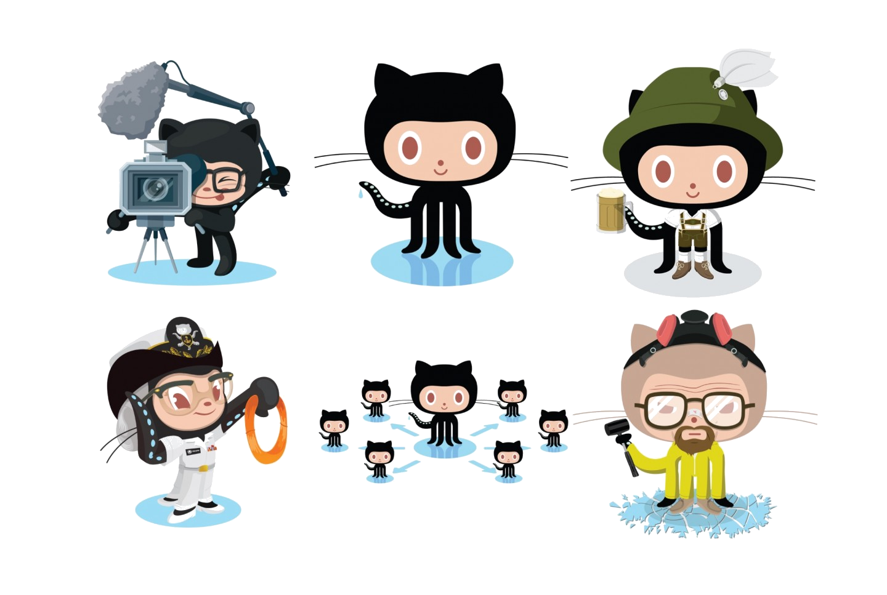
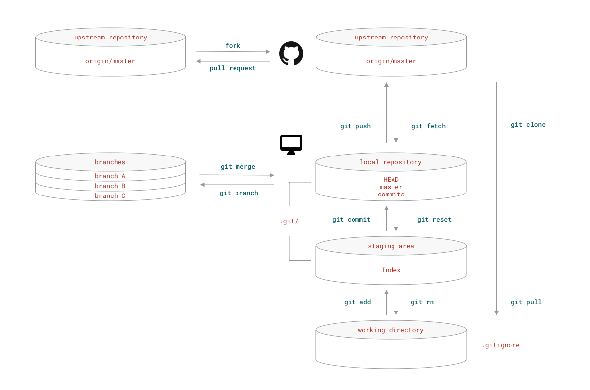

# Git 簡介

--- You should've learned Git yesterday.



## 內容目標

再一次，這一篇內容的目標，依然不是 “教程”，而是 “教程” 的 “圖例” —— 如果我們把真正的教程比喻成 “地圖” 的話。最全面的 Git 教程在網上， **Pro Git**，是免費的 —— 把它反覆閱讀若干遍，理解完整：

> https://git-scm.com/book/en/v2

並且還有各種語言的翻譯版本 —— 也包括中文。

## 為什麼你必須學會使用 Git？

Git 是一個分佈式版本控制軟件 —— 聽起來也許跟你沒關係，但**無論是誰**，都會因為能夠使用 Git 而節約時間、提高效率。進而，如果你居然沒有一個活躍的 [Github](https://github.com) 賬戶，那麼你正在錯過人類史上前所未有的共同協作時代 —— 半點都沒有誇張。同樣提供 Git 工具雲服務的還有 [Gitlab](https://gitlab.com), [Bitbucket](https://bitbucket.org) 等等。

並且，[Github](https://github.com) 很可能是地球上第一個給人們提供 “[用作品社交](Part.3.F.social-selfteaching.md)” 方式的平臺，你若是不能參與其中，實在是太可惜了！

## 從邏輯上理順 Git 基本命令

Git 的作用，基本上可以被劃分為三部分：
> - 備份文件
> - 跟蹤文件變化
> - 與他人協作共同操作文件

在一個 git 倉庫中，總計有四個 “抽象層”，它們分別是：

> * upstream repository 保存在雲端的倉庫
> * local repository 本地倉庫
> * staging area 緩存區
> * working directory 工作區

其中，`local repository` 和 `staging area` 這兩個抽象層的數據，保存在 `working directory` 根目錄下的一個隱藏目錄 `.git/` 下；需要使用 `ls -a` 才能看到。

當你使用 `git init` 命令將一個本地文件夾 `working directory` 初始化為 `local repository` 的之後，該文件夾內部的結構如下：
```
.
└── .git
    ├── HEAD
    ├── config
    ├── description
    ├── hooks
    │   ├── applypatch-msg.sample
    │   ├── commit-msg.sample
    │   ├── fsmonitor-watchman.sample
    │   ├── post-update.sample
    │   ├── pre-applypatch.sample
    │   ├── pre-commit.sample
    │   ├── pre-push.sample
    │   ├── pre-rebase.sample
    │   ├── pre-receive.sample
    │   ├── prepare-commit-msg.sample
    │   └── update.sample
    ├── info
    │   └── exclude
    ├── objects
    │   ├── info
    │   └── pack
    └── refs
        ├── heads
        └── tags
```
以下示意圖中僅包含最基本的 Git 命令 —— 並且基本上都是獨自使用 Git 時的常用命令。



在工作區 `working directory` 這個抽象層中，你完成各種日常工作，創建、編輯、刪除…… 你可能需要用某個編輯器去修改文件，你也可能頻繁使用各種 Bash 命令，如，`rm` `mkdir` `cp` `mv` 等等。

時不時，你可能會把一些處理完的文件 “加入緩存區”；等一個階段的工作完成之後，你可能會把那些已經放入緩存區的文件**提交**到（commit）本地倉庫；而後繼續工作…… 根據情況，你也會將本地倉庫的文件**推到**（push）雲端，即，遠端倉庫。如果，你正在與他人協作，你也可能經常需要從雲端**下拉**（pull）最新版本到本地。

## Git 的安裝

### Mac

Mac 的操作系統 Mavericks (10.9) 以上版本中都內建有 Git，你可以在 Terminal 中通過以下命令查看是否有 Git：
``` bash
git --version
which git
```
也可以通過 Homebrew 安裝最新版本的 Git：
``` bash
ruby -e "$(curl -fsSL https://raw.githubusercontent.com/Homebrew/install/master/install)"
brew doctor
brew install git
```
還可以通過 Conda 安裝：
``` bash
conda install -c anaconda git
```
### Windows

前往 https://gitforwindows.org 下載並安裝 Git for Windows。

此外，它還會提供 Git Bash —— 在 Windows 操作系統中使用與 \*Nix 操作系統一樣的 Bash 命令行工具。

另外，在 Windows 操作系統中推薦使用 Git Bash 或者 PowerShell，而非 CMD 作為命令行工具。

### Linux

大多數 Linux 操作系統要麼基於 Debain，要麼基於 Red-Hat —— 請自行查看 [List of Linux distributions](https://en.wikipedia.org/wiki/List_of_Linux_distributions)，確定自己的 Linux 發行版究竟基於哪一個。

基於 Debian 的 Linux 發行版：
```bash
sudo apt-get update
sudo apt-get upgrade
sudo apt-get install git
```
基於 Red-Hat 的 Linux 發行版：
```bash
sudo yum upgrade
sudo yum install git
```
### Git 本地配置

在命令行工具中執行以下命令：
```bash
git config --global user.name "<your_name>"
git config --global user.email <your_email_address>
```
### Git GUI

Git 的圖形化版本客戶端，有很多種選擇，以下幾個跨平臺的客戶端最受歡迎：

> * [Github Desktop](https://desktop.github.com) 
> * [GitAhead](https://gitahead.github.io/gitahead.com/)
> * [Fork](https://git-fork.com)
> * [GitKraken](https://www.gitkraken.com)

更多選擇，請移步查看 [git-scm.com 上的 Git GUI Clients 列表](https://git-scm.com/downloads/guis/)。

### 需要瞭解的 Bash 基本命令

雖然 Git 也有圖形化版本，但無論如何你都會接觸到命令行工具。並且，誰都一樣，早晚會遇到非使用命令行不可的情況。

以下是常用 Bash 命令的簡要說明：

| 命令  | 簡要說明                                            |
| ----- | --------------------------------------------------- |
| `cd`    | Change Directory 的縮寫；轉到指定目錄               |
| `ls`    | List 的縮寫；列出當前目錄中的內容                   |
| `mkdir` | Make Directory 的縮寫；在當前目錄中創建一個新的目錄 |
| `pwd`   | Present Working Directory 的縮寫；顯示當前工作目錄  |
| `touch` | 創建一個指定名稱的空新文件                          |
| `rm`    | Remove 的縮寫；刪除指定文件                         |
| `rmdir` | Remove Directory 的縮寫；刪除指定目錄               |
| `cp`    | Copy 的縮寫；拷貝指定文件                           |
| `mv`    | Move 的縮寫；移動指定文件                           |
| `cat`   | Concatenate 的縮寫；在屏幕中顯示文件內容            |
| `chmod`   | Change Mode 的縮寫；改變文件的權限           |
| `man`   | Manual 的縮寫；顯示指定命令的使用說明          |

其中，`chmod` 最常用的 4 個權限分別是：

| 文件權限模式  | 簡要說明                                            |
| ----- | --------------------------------------------------- |
| `777`    | 任何人都可以讀、寫、執行該文件               |
| `755`    | 任何人都可以讀、執行該文件，但只有所有者可以修改        |
| `700` | 只有所有者才能進行讀、寫、執行操作 |
| `+x`   | 將文件設置為可執行  |

在使用 `man` 命令時，系統會使用 vim 文本編輯工具以只讀模式打開說明檔案，常用鍵盤命令如下：


| 鍵盤命令  | 簡要說明                                            |
| ----- | --------------------------------------------------- |
| `f`    | 向後翻屏               |
| `b`    | 向前翻屏        |
| `d` | 向後翻半屏 |
| `u`   | 向前翻半屏  |
| `j`   | 向後翻一行  |
| `k`   | 向前翻一行  |
| `h`   | 查看 vim 幫助  |
| `q`   | 退出  |

## 一些不錯的 Git 教程

除了 Pro Git 這本書之外，還有很多值得去看：

> * [GIT CHEATSHEET -- an interaction from nop software](http://ndpsoftware.com/git-cheatsheet.html)
> * [Learn Git Branching](https://learngitbranching.js.org/)
> * [Learn Git in a Month of Lunches](https://livebook.manning.com/#!/book/learn-git-in-a-month-of-lunches/about-this-book/)
> * [Git How To](https://githowto.com/)
> * [Git pretty - Solve Git Mess](http://justinhileman.info/article/git-pretty/)
> * [Visualizing Git Concepts with D3](http://onlywei.github.io/explain-git-with-d3/)

當然，你肯定早晚會去 Github 上找 “Awesome Git”：

> https://github.com/dictcp/awesome-git
