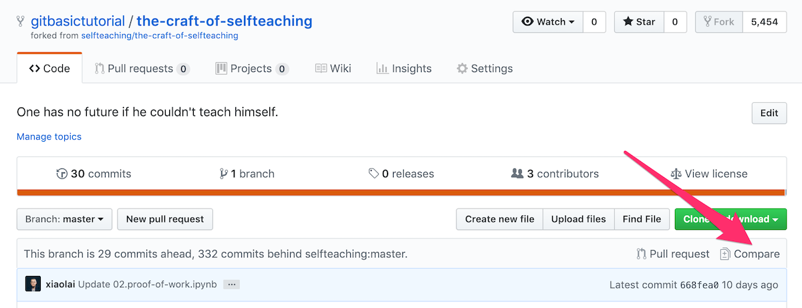
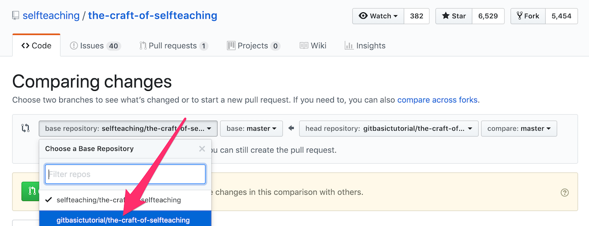
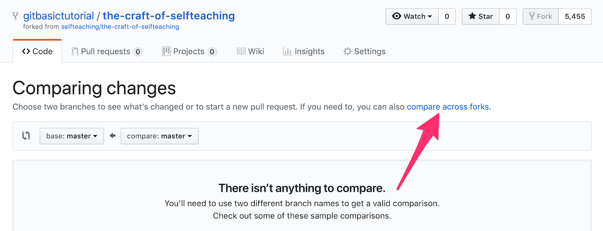
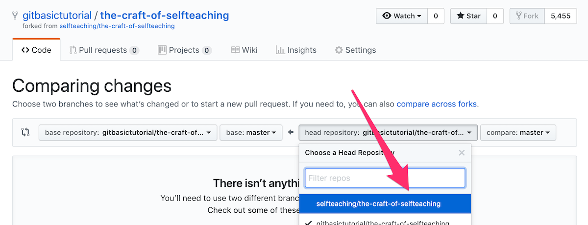
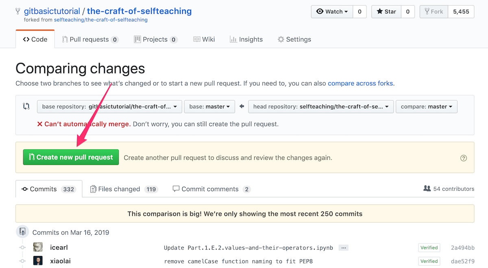
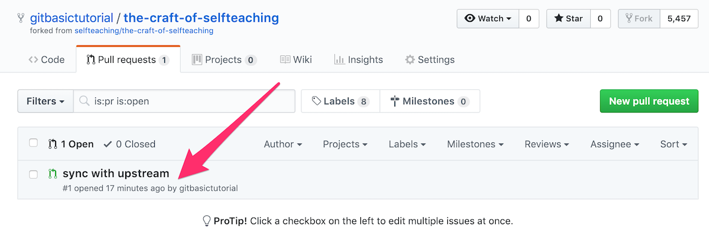
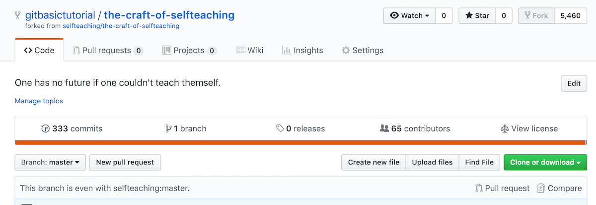

# 如何證明你真的讀過這本書？

## 積ん読

日語里有個很好玩的詞，“**積ん読**”（[tsundoku](https://en.wikipedia.org/wiki/Tsundoku)）：

> 指那些買回來堆在那裡還沒讀過的（甚至後來乾脆不看了的）書……

細想想，每個人都有很多很多 “積ん読”。小時候我們拿回家的教科書中就有相當一部分，其實就是 “積ん読”，雖然那時候掏錢買書的是父母，不仔細看、或者乾脆不看的時候，也知道自己在偷懶…… 再後來就是 “主動犯罪” 了 —— 比如，很多人買到手裡的英語詞彙書是根本就沒有翻到過第二個列表的，乃至於過去我常常開玩笑說，中國學生都認識一個單詞，*abandon*，不是嗎？這個單詞是很多很多人 “決心重新做人” 而後 “就這樣罷” 的鐵板釘釘的見證者。

在沒有電子書的時代，印刷版書籍多少還有一點 “裝飾品” 功用，可是到了電子書時代，誰知道你的設備里有多少付費書籍呢？攢下那麼多，其實並沒有炫耀的地方，給誰看呢？據說，Kindle 的後臺數據里可以看到清楚的 “打開率”，大抵上也是在 $^1/_4$ ~ $^1/_3$ 之間，也就是說，差不多有 $^2/_3$ ~ $^3/_4$ 的電子書籍被購買下載之後，從來就沒有被打開過。

如此看來，付費之後並不閱讀，只能欺騙一個對象了：自己。跟心理學家們之前想象的不同，我認為人們通常是不會欺騙自己的，至少很難 “故意欺騙自己”。所以，對於 “買了之後堅決不讀” 這個現象，我不認為 “給自己虛妄的滿足感” 是最好的解釋。

更朴素一點，更接近真相的解釋是：

> 那百分之七八十的人，其實是想著給自己一個希望……

—— 等我有空了一定看。嗯。

說來好笑，其實每個人共同擁有的目標之一是這樣的：

> 成為前百分之二十的少數人……

然而，PK 掉百分之七八十的人的方法真的很簡單很簡單啊：

> 把買來的書都真真切切地認真讀過就可以了。

這實在是太簡單了罷？！可是…… 我知道你剛剛那個沒出息的閃念：

> 那我少買書甚至不買書不就可以了嗎？

你自己都知道這是荒謬的，卻忍不住為你的小聰明得意 —— 其實吧，幸虧有你們在，否則我們怎麼混進前百分之二十呢？

## PoW

比特幣這個地球上第一個真正被證明為可行的區塊鏈應用中有一個特別重要的概念，叫做 “**工作證明**”（Proof of Work）—— 你幹活了就是幹活了，你沒幹活就是沒幹活，你的工作是可被證明的……

借用這個思路，我設計了個方法，讓你有辦法證明自己就是看過這本書，就是讀完了這本書 —— 你能向自己也向別人證明自己曾經的工作…… 是不是挺好？

證明的方法是使用 [github.com](https://github.com) 這個網站以及版本控制工具 **git**。

## 具體步驟

請按照以下步驟操作：

> 1. 註冊 [github.com](https://github.com) 帳號 —— 無論如何你都必須有 github 賬戶；
> 2. 使用瀏覽器訪問 [https://github.com/selfteaching/the-craft-of-selfteaching](https://github.com/selfteaching/the-craft-of-selfteaching)；
> 3. 在頁面右上部找到 “Fork” 按鈕，將該倉庫 Fork 到你自己的賬戶中；
> 4. 使用 `git clone` 命令或者使用 [Desktop for Github](https://desktop.github.com/) 將 [the craft of selfteaching](https://github.com/xiaolai/the-craft-of-selfteaching) 這個你 Fork 過來的倉庫克隆到本地；
> 5. 按照 [Jupyterlab 的安裝與配置](T-appendix.jupyter-installation-and-setup.ipynb) 的說明在本地搭建好 Jupyterlab —— 如果在 Jupyterlab 中瀏覽本書的話，其中的所有代碼都是可以 “當場執行” 的，並且，你還可以直接改著玩……
> 6. 在閱讀過程中，可以不斷通過修改文章中的代碼作為練習 —— 這樣做的結果就是已閱讀過的文件會發生變化…… 每讀完一章，甚至時時刻刻，你都可以通過 `git commit` 命令向你自己 Fork 過來的倉庫提交變化 —— 這就是你的閱讀工作證明；
> 7. 倉庫里有一個目錄，`my-notes`，你可以把你在學習過程中寫的筆記放在那裡；
> 8. 倉庫里還有另外一個目錄，`from-readers`；那是用來收集讀者反饋的 —— 將來你可以寫一篇《我的自學之路》，放在這個目錄里，單獨創建一個分支，而後提交 `pull request`，接受其他讀者投票，若是達到一定的贊同率，那麼你的文章就會被收錄到主倉庫中被更多人看到，激勵更多的人像你一樣走上自學之路……

當然，為了這麼做，你還要多學一樣反正你早晚都必須學會的東西，Git —— 請參閱附錄 《[Git 入門](T-appendix.git-introduction.ipynb)》。

時間就是這樣，我們沒辦法糊弄它。而有了 git 這樣的工具之後，我們在什麼時候做了什麼樣的工作，是很容易證明的 —— 這對我們來說真是天大的好事。

## 如何使用 Pull Request 為這本書校對

另外，在你閱讀的過程中，發現有錯別字啊、代碼錯誤啊，甚至有 “更好的表述” 等等，都可以通過 `pull request` 來幫我改進 —— 這也是一種 “工作證明”。

(1) 使用瀏覽器訪問 https://github.com/selfteaching/the-craft-of-selfteaching

(2) 點擊右上角的 “Fork 按鈕”，將該倉庫 Fork 到你的 Github 賬戶中


(3) 創建一個新分支，可以取名為 `from-<your_username>`，比如，`by git.basic.tutorial`；


(4) 在新分支下進行修改某個文件，而後提交 —— 提交前不要嫌麻煩，一定要在 Comment 中寫清楚修改說明：


以上示例圖片中是修改了 README.md 文件 —— 事實上，你應該提交的是的確有必要的校對。

另外，**請註意**：在創建分支之前，要將你的 Fork 更新到最新版。具體操作方法見下一節《如何在 Github 網站上將自己的 Fork 與原倉庫同步》。

(5) 在頁面頂部選擇 Pull request 標簽：


而後點擊 `Compare & pull request` 按鈕 —— 如果看不到這個按鈕，那就點擊下麵剛剛修改文件的鏈接，如上圖中的 “Update README.md”（這是你剛剛提交修改時所填寫的標題）。


確認無誤之後，點擊 `Create pull request` 按鈕。


(6) 隨後，Github 用戶 [@xiaolai](https://github.com/xiaolai) —— 就是我，即，the-craft-of-selfteaching 這個倉庫的所有者，會被通知有人提交了 Pull request，我會看到：


在我確認這個 Pull request 修改是正確的、可接受的之後，我就會按 `Merge pull request` 按鈕 —— 如此這般，一個修正就由你我共同完成了。


**註意**

提交 Pull request 的時候，最佳策略如下：

> * 提交 Pull request 之前，必須先將你的 Fork 與原倉庫同步到最新；
> * 儘量每次只提交一個小修改；
> * 提交時儘量簡短且清楚地說明修改原因；
> * 耐心等待回覆。

當自己的 Fork 過來的倉庫已經被你在本地 “玩殘” 了的時候，它千萬不能被當作用來提交 Pull request 的版本。自己本地怎麼玩都無所謂，但需要向別人提交 Pull request 的時候，必須重新弄一個當前最新版本到本地，而後再在其基礎上修改。

## 如何在 Github 網站上將自己的 Fork 與原倉庫同步

(1) 在你的 Fork 頁面中如下圖所示，點擊 `Compare` 鏈接：



(2) 將 `base repository` 更改成當前自己的 Fork，在圖示中即為 `gitbasictutorial/the-craft-of-selfteaching`：



(3) 這時候，頁面會顯示 `There isn't anything to compare.`，因為你在比較“自己”和“自己”。點擊 `compare across forks` 鏈接：



(4) 將 `head repository` 更改成 Upstream Repository（即，上游倉庫），在圖示中即為 `selfteaching/the-craft-of-selfteaching`：



(5) 稍等片刻，你會看到比較結果；而後你可以創建一個 Pull request —— 這是一個由你自己向你自己的 Fork 倉庫提交的 Pull request：



(6) 而後你在 `Pull requests` 標簽頁里會看到你剛剛提交的 Pull request：



(7) 同意併合並之後的結果是，你的 Fork 與上游倉庫同步完成了：



當然，有時會出現一些你無法解決的問題，那麼，還有一個最後的方法：

> 將你的 Fork 刪除，而後重新到 https://github.com/selfteaching/the-craft-of-selfteaching 頁面按一次 `Fork` 按鈕……

## 如何使用 github 記錄自己的學習過程

你可以在本地建立一個分支（branch），例如，取名為 `study`：

```bash
git branch study
git checkout study
```

如此這般之後，你在本地工作目錄中所做的任何修改，都可以提交到 `study` 這個分支之中。

你每次在 Jupyterlab 中瀏覽 `ipynb` 文件，按 `^ + Enter` 執行 code cell 中的代碼的時候，該文件都會發生一些變化；你也可以隨意修改文件中的任何地方，比如，添加一個 code cell，將某段代碼從頭至尾“敲”一遍；也可以修改某個 code cell 中的代碼看看執行結果有什麼不同；還可以添加或者修改任何 markdown cell —— 就當自己做筆記了……

總而言之，當你閱讀完某一章節並如上所說那樣做了一些改動之後，那個 `ipynb` 文件就發生了一些變化。於是，你就可以執行以下命令：

```bash
git add .
git commit -am 'my study result'
git push
```

如此這般，在 `study` 這個分支中就記錄著你的學習軌跡。

當然，如果在這過程中，你發現本書自身有需要校對的地方，那麼，你需要切換到 `master` 分支，執行以下命令：

```bash
git checkout master
git pull
```

而後再修改，進而按照上一節的方法提交 Pull request。

未來，在 [https://github.com/selfteaching](https://github.com/selfteaching) 下我會專門設置一個 repo，用來自動掃描 github 上本書的學習記錄 —— 這種記錄在過往的書籍當中是不可能存在的，然而，現在卻可以了。在我看來，將來這種記錄的作用甚至有可能比“學歷”還要重要。
