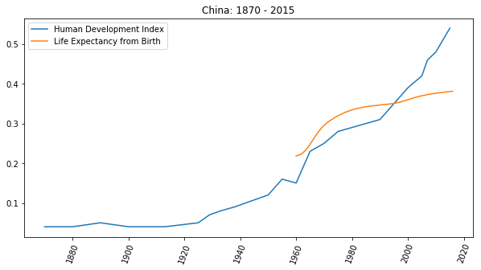

# 為什麼一定要掌握自學能力？

一句話解釋清楚：

> 沒有自學能力的人沒有**未來**。

有兩個因素需要深入考慮：

> * 未來的日子還很長
> * 這世界進步得太快

我有個觀察：

> 很多人都會不由自主地去復刻父母的人生時刻表。

比如，你也可能觀察到了，父母晚婚的人自己晚婚的概率更高，父母晚育的人自己晚育的概率也更高…… 

再比如，絕大多數人的內心深處，會不由自主地因為自己的父母在五十五歲的時候退休了，所以就默認自己也會在五十五歲前後退休…… 於是，到了四十歲前後的時候就開始認真考慮退休，在不知不覺中就徹底喪失了鬥志，早早就活得跟已經老了很多歲似的。

但是，這很危險，因為很多人完全沒有意識到自己所面臨的人生，與父母所面臨的人生可能完全不一樣 —— 各個方面都不一樣。單舉一個方面的例子，也是比較容易令人震驚的方面：

> 全球範圍內都一樣，在過去的五十年裡，人們的平均壽命預期增長得非常驚人……

拿中國地區做例子，根據世界銀行的數據統計，中國人在出生時的壽命預期，從 1960 年的 _43.73_ 歲，增長到了 2016 年的 _76.25_ 歲，56 年間的增幅竟然有 **74.39%** 之多！
```python
import matplotlib.pyplot as plt
import numpy as np

data = np.genfromtxt('life-expectancy-china-1960-2016.txt',
                     delimiter=',',
                     names=['x', 'y'])
da1960  = data[0][1]
da2016  = data[-1][1]
increase = (da2016 - da1960) / da1960
note = 'from {:.2f} in 1960 to {:.2f} in 2016, increased  {:.2%}'\
    .format(da1960, da2016, increase)

plt.figure(figsize=(10, 5))
plt.plot(data['x'], data['y'])
plt.ylabel('Life Expectancy from Birth')
plt.tick_params(axis='x', rotation=70)
plt.title('CHINA\n' + note)

# plt.savefig('life-expectancy-china-1960-2016.png', transparent=True)
plt.show()

# data from:
# https://databank.worldbank.org/data/reports.aspx?source=2&series=SP.DYN.LE00.IN
```


如此發展下去，雖然人類不大可能永生不死，但平均壽命依然在持續延長是個不爭的事實。與上一代不同，現在的千禧一代，需要面對的是百歲人生 —— 毫無疑問，不容置疑。

這麼長的人生，比默認的想象中可能要多出近一倍的人生，再疊加上另外一個因素 —— 這是個變化越來越快的世界 —— 會是什麼樣子？

我是 1972 年出生的。從交通工具來看，我經歷過出門只能靠步行，大街上都是牛車馬車，機動車頂多見過拖拉機，到有自行車，到見過摩托車，到坐小汽車，到自己開車，到開有自動輔助駕駛功能的電動車…… 從閱讀來看，我經歷過只有新華書店，到有網絡上的文字，到可以在噹噹上在線買到紙質書，到有了國際信用卡後可以在 Amazon 上第一時間閱讀新書的電子版、聽它的有聲版，到現在可以很方便地獲取最新知識的互動版，並直接參与討論…… 從技能上來看，我經歷過認為不識字是文盲，到不懂英語是文盲，到不懂計算機是文盲，到現在，不懂數據分析的基本與文盲無異……

我也見識過很多當年很有用很賺錢很令人羡慕的技能 “突然” 變成幾乎毫無價值的東西，最明顯的例子是駕駛。也就是二十多年前，的哥還是很多人羡慕的職業呢！我本科的時候學的是會計專業，那時候我們還要專門練習打算盤呢！三十年之後的今天，就算有人打算盤打得再快，有什麼具體用處嘛？我上中學的時候，有個人靠出版字帖賺了大錢 —— 那時候據說只要寫字漂亮就能找到好工作；可今天，寫字漂亮與否還是決定工作好壞的決定性因素嗎？印表機很便宜啊！

這兩個因素疊加在一起的結果就是，這世界對很多人來說，其實是越來越殘忍的。

我見過太多的同齡人，早早就停止了進步，早早就被時代甩在身後，早早就因此茫然不知所措 —— 早早晚晚，你也會遇到越來越多這樣的人。他們的共同特征只有一個：

> 沒有自學能力

有一個統計指數，叫做人類發展指數（Human Development Index），它的曲線畫出來，怎麼看都有即將成為指數級上升的趨勢。
```python
import matplotlib.pyplot as plt
import numpy as np
plt.figure(figsize=(10, 5))

lebdata = np.genfromtxt('life-expectancy-china-1960-2016.txt',
                        delimiter=',',
                        names=['x', 'y'])

hdidata = np.genfromtxt('hdi-china-1870-2015.txt',
                        delimiter=',',
                        names=['x', 'y'])


plt.plot(hdidata['x'], hdidata['y'], label='Human Development Index')
plt.tick_params(axis='x', rotation=70)
plt.title('China: 1870 - 2015')

plt.plot(lebdata['x'], lebdata['y'] * 0.005, label='Life Expectancy from Birth')
plt.plot(secondary_y=True)

plt.legend()

# plt.savefig('human-development-index-china-1870-2015.png', transparent=True)
plt.show()

# link:
# https://ourworldindata.org/human-development-index

# data from:
# blob:https://ourworldindata.org/44b6da71-f79e-42ab-ab37-871e4bd256e9
```



社會發展越來越快，你要面對的人生越來越長，在那一段與你的直覺猜想並不相同的漫漫人生路上，你居然沒有磨練過自學能力，竟然只能眼睜睜地看著自己被甩下且無能為力，難道接下來要在那麼長的時間里 “苦中作樂” 嗎？

沒有未來的日子，怎麼過呢？

我本科學的是會計，研究生跑到國外讀宏觀經濟學沒讀完，跑回國內做計算機硬件批發，再後來去新東方應聘講授托福課程，離開新東方之後創業，再後來做投資，這期間不斷地寫書…… 可事實上，我的經歷在這個時代並不特殊。有多少人在後來的職業生涯中所做的事情與當年大學里所學的專業相符呢？

紐約聯邦儲蓄銀行在 2012 年做過一個調查，發現人們的職業與自己大學所學專業相符的比例連 _30%_ 都不到。而且，我猜，這個比例會持續下降的 —— 因為這世界變化快，因為大多數教育機構與世界發展脫鉤的程度只能越來越嚴重……
```python
import matplotlib.pyplot as plt

labels = ['Major Match', '']
sizes = [273, 727]
colors = ['#E2E2E2', '#6392BF']
explode = (0, 0.08)
plt.figure(figsize=(7, 7))
plt.pie(sizes,
        labels=labels,
        explode=explode,
        autopct='%1.1f%%',
        colors=colors,
        startangle=270,
        shadow=True)
# plt.savefig('major-match-job.png', transparent=True)
plt.show()

# data from:
# https://libertystreeteconomics.newyorkfed.org/2013/05/do-big-cities-help-college-graduates-find-better-jobs.html
```


絕大多數人終生都飽受**時間幻覺**的拖累。

小時候覺得時間太長，那是幻覺；長大了覺得時間越來越快，那還是幻覺 —— 時間從來都是勻速的。最大的幻覺在於，總是以為 “時間不夠了” —— 這個幻覺最坑人。許多年前，有一次我開導我老婆。她說，“啊？得學五年才行啊？！太長了！” 我說，

> “你回頭看看唄，想想唄，五年前你在做什麼？是不是回頭一看的時候，五年前就好像是昨天？道理是一樣的，五年之後的某一天你回頭想今天，也是 ‘一轉眼五年就過去’ 了…… 只不過，你今天覺得需要時間太多，所以不肯學 —— 但是，不管你學還是不學，五年還是會 ‘一轉眼就過去’ 的…… 到時候再回頭，想起這事兒的時候，沒學的你，一定會後悔 —— 事實上，你已經有很多次後悔過 ‘之前要是學了就好了’，不是嗎？”

現在回頭看，開導是非常成功的。十多年後的今天，她已經真的可以被稱為 “自學專家” —— 各種運動在她那兒都不是事兒。健身，可以拿個北京市亞軍登上健與美雜誌封面；羽毛球，可以參加專業比賽；潛水，潛遍全球所有潛水勝地，到最後拿到的各種教練證比她遇到的各地教練的都多、更高級；帆船，可以組隊橫跨大西洋；爬山，登上喜馬拉雅……

都說，人要有一技之長。那這一技究竟應該是什麼呢？

> 自學能力是唯一值得被不斷磨練的長技。

磨練出自學能力的好處在於，無論這世界需要我們學什麼的時候，我們都可以主動去學，並且還是馬上開始 —— 不需要等別人教、等別人帶。

哪怕有很強的自學能力的意思也並不是說，什麼都能馬上學會、什麼都能馬上學好，到最後無所不精無所不通…… 因為這裡有個時間問題。無論學什麼，都需要耗費時間和精力，與此同時更難的事情在於不斷填補耐心以防它過早耗盡。另外，在極端的情況下，多少也面臨天分問題。比如身高可能影響打籃球的表現，比如長相可能影響表演的效果，比如唱歌跑調貌似是很難修複的，比如有些人的粗心大意其實是基因決定的，等等。不過，以我的觀察，無論是什麼，哪怕只是學會一點點，都比不會強。哪怕只是中等水平，就足夠應付生活、工作、養家糊口的需求。

我在大學里學的是會計專業，畢業後找不到對口工作，只好去做銷售 —— 沒人教啊！怎麼辦？自學。也有自學不怎麼樣的時候，比如當年研究生課程我就讀不完。後來想去新東方教書 —— 因為聽說那裡賺錢多 —— 可英語不怎麼樣啊！怎麼辦？自學。離開新東方去創業，時代早就變了，怎麼辦？自學，學的不怎麼樣，怎麼辦？硬挺。雖然創業這事兒後來也沒怎麼大成，但竟然在投資領域開花結果 —— 可賺了錢就一切平安如意了嗎？並不是，要面對之前從來沒可能遇到的一些險惡與困境，怎麼辦？自學。除了困境之外，更痛苦的發現在於對投資這件事來說，並沒有受過任何有意義的訓練，怎麼辦？自學。覺得自己理解的差不多了，一齣手就失敗，怎麼辦？接著學。

我出身一般，父母是窮教師。出生在邊疆小鎮，兒時受到的教育也一般，也是太淘氣 —— 後來也沒考上什麼好大學。說實話，我自認天資也一般，我就是那種被基因決定了經常馬虎大意的人。歲數都這麼大了，情商也都不是一般的差 —— 還是跟年輕的時候一樣，經常莫名其妙就把什麼人給得罪透了……

但我過得一直不算差。

靠什麼呢？人麽，一個都靠不上。到最後，我覺得只有一樣東西真正可靠 —— **自學能力**。於是，經年累月，我磨練出了一套屬於我自己的本領：只要我覺得有必要，我什麼都肯學，學什麼都能學會到夠用的程度…… 編程，我不是靠上課學會的；英語，不是哪個老師教我的；寫作，也不是誰能教會我的；教書，更沒有上過師範課程；投資，更沒人能教我 —— 我猜，也沒人願意教我…… 自己用的東西自己琢磨，挺好。

關鍵在於，自學這事兒並不難，也不複雜，挺簡單的，因為它所需要的一切都很朴素。

於是，從某個層面上來看，我每天都過的很開心。為什麼？因為我有未來。憑什麼那麼確信？因為我知道我自己有自學能力。

**—— 我希望你也有。**

準確地講，希望你有個更好的未來。

而現在我猜，此刻，你心中也是默默如此作想的罷。
